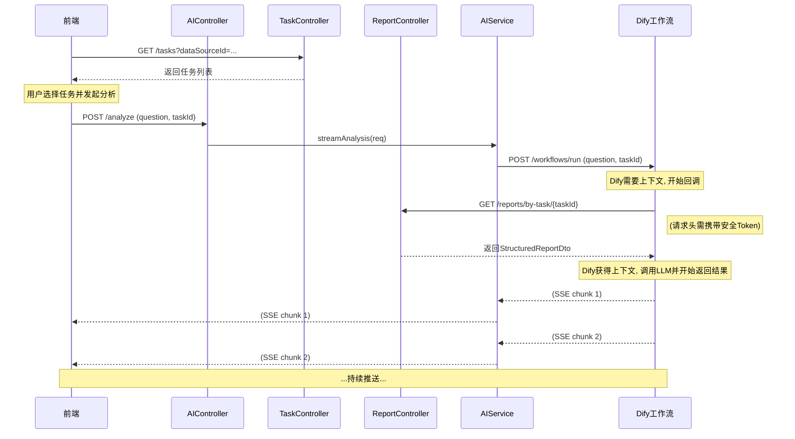

### DBCrawlerV3-AI模块 后端设计文档 (基于方案A)

#### 1\. 文档概述

##### 1.1 文档目的

本文档详细定义了在`DBCrawlerV3`平台中集成AI服务（基于Dify工作流）的后端模块设计。本文档遵循**方案A**架构，即后端服务主要负责任务调度与API服务，而AI服务（Dify）则主动回调后端API以获取上下文数据。

##### 1.2 适用范围

  - 后端开发人员
  - 系统架构师
  - API使用者（前端和Dify工作流）

-----

#### 2\. 方案目标

1.  **实现AI集成：** 在`DBCrawlerV3`后端中新增AI模块，负责接收前端的分析请求，并将其调度至Dify工作流。
2.  **提供数据服务：** 暴露安全的、仅供AI服务调用的API端点，使其能够根据`taskId`查询所需的数据画像报告。
3.  **支持前端交互：** 提供API以支持前端选择分析任务，并通过SSE（Server-Sent Events）流式技术将AI结果实时返回给用户。

-----

#### 3\. 架构设计与变更

为实现AI功能，我们将在您现有的分层架构中引入一个新的**AI模块**，并对现有模块进行少量扩展。

##### 3.1 整体架构（含AI模块）

```
┌─────────────────────────────────────────────────────────────┐
│                    API控制层 (Controllers)                   │
├─────────────────────────────────────────────────────────────┤
│ ...现有Controllers... │ ┌────────────────┐ │ ┌────────────────┐ │
│                       │ │ AIController   │ │ │ TaskController │ │
│                       │ │ (新增)         │ │ │ (扩展)         │ │
│                       │ └────────────────┘ │ └────────────────┘ │
└─────────────────────────────────────────────────────────────┘
                              │
                              ▼
┌─────────────────────────────────────────────────────────────┐
│                    业务服务层 (Services)                     │
├─────────────────────────────────────────────────────────────┤
│ ...现有Services... │ ┌────────────────┐ │ ┌────────────────┐ │
│                    │ │ AIService      │ │ │ DifyApiClient  │ │
│                    │ │ (新增)         │ │ │ (新增)         │ │
│                    │ └────────────────┘ │ └────────────────┘ │
└─────────────────────────────────────────────────────────────┘
                              │
                              ▼
        ┌───────────────────────────────────────────────────┐
        │                 外部服务 (External)                 │
        ├───────────────────────────────────────────────────┤
        │                  Dify Workflow API                  │
        └───────────────────────────────────────────────────┘
```

##### 3.2 新增/变更组件职责

  * **`AIController` (新增):**
      * **职责：** 处理所有来自前端的AI分析请求。
      * **核心功能：** 暴露一个流式的SSE端点，接收`question`和`taskId`，并将任务委托给`AIService`。
  * **`AIService` (新增):**
      * **职责：** AI分析任务的核心业务逻辑编排。
      * **核心功能：** 调用`DifyApiClient`，启动Dify工作流，并管理SSE连接，将Dify返回的流式结果转发给前端。
  * **`DifyApiClient` (新增):**
      * **职责：** 封装对Dify工作流API的所有HTTP调用细节。
      * **核心功能：** 发起对Dify工作流的调用，处理认证、请求体构建和响应流的接收。
  * **`ProfilingTaskController` & `Service` (扩展):**
      * **职责：** 需要新增一个API，允许前端根据`dataSourceId`查询已完成的任务列表。
  * **`ReportController` & `Service` (扩展):**
      * **职责：** 需要确保其查询接口的**安全性**，因为它将被外部的Dify服务回调。

-----

#### 4\. 模块详细设计

##### 4.1. 配置层 (`application.yml`)

```yaml
dify:
  api:
    base-url: "https://api.dify.ai/v1"
    key: "${DIFY_API_KEY}"
  # 新增：用于保护回调API的安全Token
  security:
    callback-token: "${DIFY_CALLBACK_TOKEN}" 
```

##### 4.2. 控制层 (Controller Layer)

**1. `AIController.java` (新增)**

```java
@RestController
@RequestMapping("/api/v1/ai")
public class AIController {
    @Autowired private AIService aiService;

    // 前端调用的主分析接口
    @PostMapping("/analyze")
    public SseEmitter analyze(@RequestBody AnalysisRequest request) {
        return aiService.streamAnalysis(request);
    }
}

// DTO for the request
public class AnalysisRequest {
    private String question;
    private String taskId;
    private String userId; // 用于Dify追踪用户
    // Getters and Setters...
}
```

**2. `ProfilingTaskController.java` (扩展)**

需要新增一个端点，供前端获取任务列表。

```java
@RestController
@RequestMapping("/api/v1/tasks")
public class ProfilingTaskController {
    // ... 现有代码 ...

    @GetMapping
    public ResponseEntity<List<TaskSummaryDto>> getCompletedTasks(
            @RequestParam String dataSourceId) {
        List<TaskSummaryDto> tasks = profilingTaskService.findCompletedTasksByDataSource(dataSourceId);
        return ResponseEntity.ok(tasks);
    }
}

// DTO for the task summary
public class TaskSummaryDto {
    private String taskId;
    private String name;
    private String completedAt;
    // Getters and Setters...
}
```

**3. `ReportController.java` (扩展/加固)**

Dify工作流将回调此控制器中的接口来获取数据画像。

```java
@RestController
@RequestMapping("/api/v1/reports")
public class ReportController {
    // ... 现有代码 ...

    // Dify回调的接口
    // 需要通过安全拦截器进行保护
    @GetMapping("/by-task/{taskId}")
    public ResponseEntity<StructuredReportDto> getReportForAI(@PathVariable String taskId) {
        StructuredReportDto report = structuredReportService.getReportByTaskId(taskId);
        return ResponseEntity.ok(report);
    }
}
```

##### 4.3. 服务层 (Service Layer)

**1. `AIServiceImpl.java` (新增)**

在此方案中，`AIService`的逻辑相对简单，主要负责转发。

```java
@Service
public class AIServiceImpl implements AIService {

    @Autowired private DifyApiClient difyApiClient;

    @Override
    @Async
    public SseEmitter streamAnalysis(AnalysisRequest request) {
        SseEmitter emitter = new SseEmitter(Long.MAX_VALUE);
        
        try {
            // 方案A: 只传递ID，不传递上下文
            Map<String, String> inputs = Map.of(
                "question", request.getQuestion(),
                "task_id", request.getTaskId()
            );
            DifyWorkflowRequest difyRequest = new DifyWorkflowRequest(inputs, request.getUserId(), true);

            difyApiClient.invokeWorkflowStream(difyRequest)
                .doOnNext(chunk -> { /* ... send chunk via emitter ... */ })
                .doOnComplete(emitter::complete)
                .doOnError(emitter::completeWithError)
                .subscribe();

        } catch (Exception e) {
            emitter.completeWithError(e);
        }

        return emitter;
    }
}
```

**2. `ProfilingTaskServiceImpl.java` (扩展)**

需要实现`findCompletedTasksByDataSource`方法，以支持前端的二级联动选择。

-----

#### 5\. 数据流 (Data Flow - 方案A)



-----

#### 6\. 安全性考虑

**回调API的安全是本方案的重中之重。**

  * **策略：** 采用基于Token的认证。
  * **实现：**
    1.  在`application.yml`中定义一个足够长且随机的`dify.security.callback-token`。
    2.  在Dify工作流的HTTP节点中，配置请求头，使其所有回调请求都携带 `Authorization: Bearer <your-callback-token>`。
    3.  在Spring Boot中，创建一个`HandlerInterceptor`或`Filter`，专门拦截`/api/v1/reports/by-task/**`路径。
    4.  该拦截器负责校验请求头中`Authorization`的值是否与配置文件中的`callback-token`一致。如果不一致，则返回`401 Unauthorized`或`403 Forbidden`。

-----

#### 7\. 建议的开发步骤

1.  **扩展数据查询API：**
      * 首先在`ProfilingTaskController`和`Service`中实现获取任务列表的接口。
      * 确保`ReportController`中存在一个可以通过`taskId`获取完整报告的接口。
2.  **实现安全拦截器：**
      * 为`ReportController`的回调接口添加Token认证的安全拦截器，并完成配置。
3.  **开发AI模块：**
      * 在`application.yml`中添加Dify相关配置。
      * 开发`DifyApiClient`并进行单元测试。
      * 开发`AIService`和`AIController`。
4.  **配置Dify工作流：**
      * 在Dify中，确保工作流的HTTP节点已正确配置了后端的回调URL和安全Token。
5.  **端到端测试：**
      * 启动后端服务。
      * 通过前端或API工具，完整地走一次“选择数据源 -\> 选择任务 -\> 发起分析”的全流程，验证数据流和功能是否正确。