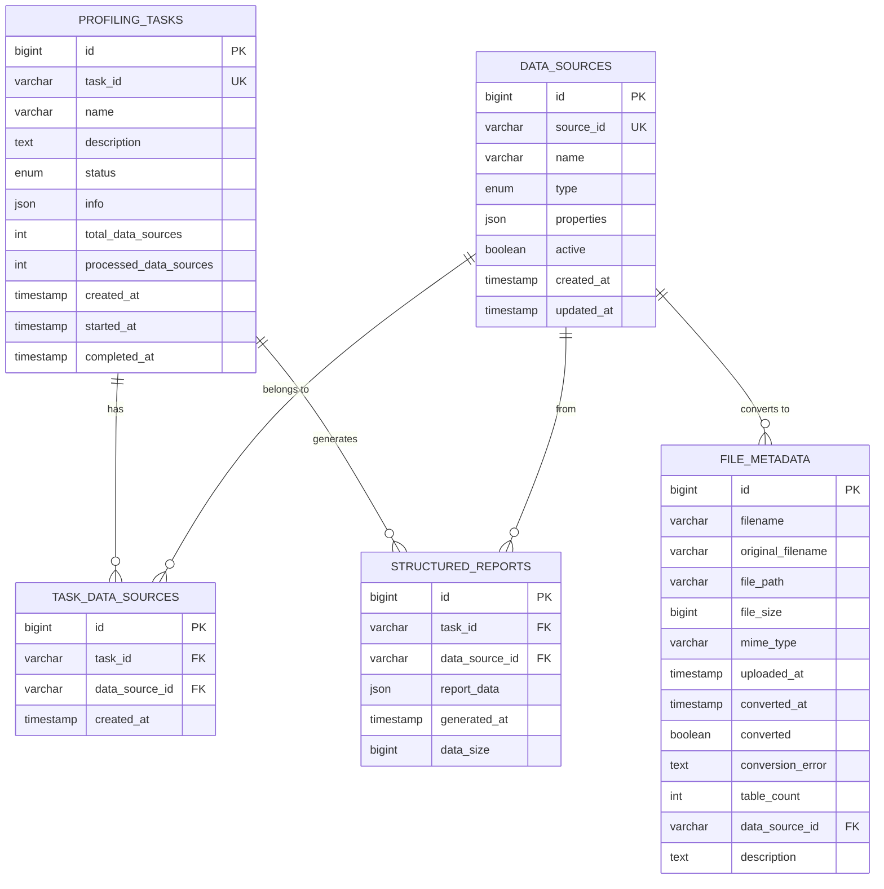

# DBCrawlerV3 数据库设计文档

## 1. 文档概述

### 1.1 文档目的
本文档详细描述了DBCrawlerV3智能数据剖析与处理平台的数据库设计，包括表结构定义、索引设计、约束关系、初始化脚本以及性能优化策略。

### 1.2 数据库选型
- **主数据库**: MySQL 8.0+
- **缓存数据库**: Redis 6.0+
- **文件转换数据库**: SQLite 3.x

### 1.3 设计原则
- **规范化设计**: 遵循第三范式，减少数据冗余
- **性能优化**: 合理设计索引，优化查询性能
- **扩展性**: 支持水平和垂直扩展
- **数据完整性**: 完善的约束和触发器机制
- **安全性**: 敏感数据加密存储

## 2. 数据库架构概览

### 2.1 逻辑架构图
```
┌─────────────────────────────────────────────────────────────┐
│                    DBCrawlerV3 Database                    │
├─────────────────────────────────────────────────────────────┤
│  Core Tables                                                │
│  ├── data_sources (数据源配置)                              │
│  ├── profiling_tasks (剖析任务)                             │
│  ├── task_data_sources (任务数据源关联)                     │
│  ├── structured_reports (结构化报告)                        │
│  └── file_metadata (文件元数据)                             │
├─────────────────────────────────────────────────────────────┤
│  Views & Procedures                                         │
│  ├── v_task_summary (任务摘要视图)                          │
│  ├── v_data_source_stats (数据源统计视图)                   │
│  ├── sp_cleanup_old_data (数据清理存储过程)                 │
│  └── sp_get_task_statistics (任务统计存储过程)              │
├─────────────────────────────────────────────────────────────┤
│  Indexes & Triggers                                         │
│  ├── Performance Indexes (性能索引)                         │
│  ├── Unique Constraints (唯一约束)                          │
│  └── Audit Triggers (审计触发器)                            │
└─────────────────────────────────────────────────────────────┘
```

### 2.2 表关系图


## 3. 核心表设计

### 3.1 数据源配置表 (data_sources)

#### 3.1.1 表结构定义
```sql
CREATE TABLE `data_sources` (
    `id` BIGINT NOT NULL AUTO_INCREMENT COMMENT '主键ID',
    `source_id` VARCHAR(100) NOT NULL COMMENT '数据源唯一标识符',
    `name` VARCHAR(255) NOT NULL COMMENT '数据源显示名称',
    `type` ENUM('MYSQL', 'POSTGRESQL', 'SQLSERVER', 'SQLITE', 'ORACLE', 'FILE') NOT NULL COMMENT '数据源类型',
    `properties` JSON NOT NULL COMMENT '数据源连接属性(加密存储)',
    `active` BOOLEAN NOT NULL DEFAULT TRUE COMMENT '是否激活状态',
    `created_at` TIMESTAMP NOT NULL DEFAULT CURRENT_TIMESTAMP COMMENT '创建时间',
    `updated_at` TIMESTAMP NOT NULL DEFAULT CURRENT_TIMESTAMP ON UPDATE CURRENT_TIMESTAMP COMMENT '更新时间',
    
    PRIMARY KEY (`id`),
    UNIQUE KEY `uk_source_id` (`source_id`),
    KEY `idx_type_active` (`type`, `active`),
    KEY `idx_created_at` (`created_at`)
) ENGINE=InnoDB DEFAULT CHARSET=utf8mb4 COLLATE=utf8mb4_unicode_ci COMMENT='数据源配置表';
```

#### 3.1.2 字段说明
| 字段名 | 类型 | 长度 | 允许空 | 默认值 | 说明 |
|--------|------|------|--------|--------|---------|
| id | BIGINT | - | NO | AUTO_INCREMENT | 主键ID |
| source_id | VARCHAR | 100 | NO | - | 数据源唯一标识符 |
| name | VARCHAR | 255 | NO | - | 数据源显示名称 |
| type | ENUM | - | NO | - | 数据源类型枚举 |
| properties | JSON | - | NO | - | 连接属性JSON对象 |
| active | BOOLEAN | - | NO | TRUE | 是否激活状态 |
| created_at | TIMESTAMP | - | NO | CURRENT_TIMESTAMP | 创建时间 |
| updated_at | TIMESTAMP | - | NO | CURRENT_TIMESTAMP | 更新时间 |

#### 3.1.3 Properties字段结构示例
```json
{
  "host": "localhost",
  "port": 3306,
  "database": "test_db",
  "username": "encrypted_username",
  "password": "encrypted_password",
  "encrypted": true,
  "connectionTimeout": 30000,
  "queryTimeout": 60000,
  "maxPoolSize": 10
}
```

### 3.2 剖析任务表 (profiling_tasks)

#### 3.2.1 表结构定义
```sql
CREATE TABLE `profiling_tasks` (
    `id` BIGINT NOT NULL AUTO_INCREMENT COMMENT '主键ID',
    `task_id` VARCHAR(100) NOT NULL COMMENT '任务唯一标识符',
    `name` VARCHAR(255) NOT NULL COMMENT '任务名称',
    `description` TEXT COMMENT '任务描述',
    `status` ENUM('PENDING', 'RUNNING', 'COMPLETED', 'FAILED', 'CANCELLED', 'TIMEOUT') NOT NULL DEFAULT 'PENDING' COMMENT '任务状态',
    `info` JSON COMMENT '任务执行信息和日志',
    `total_data_sources` INT NOT NULL DEFAULT 0 COMMENT '总数据源数量',
    `processed_data_sources` INT NOT NULL DEFAULT 0 COMMENT '已处理数据源数量',
    `created_at` TIMESTAMP NOT NULL DEFAULT CURRENT_TIMESTAMP COMMENT '创建时间',
    `started_at` TIMESTAMP NULL COMMENT '开始执行时间',
    `completed_at` TIMESTAMP NULL COMMENT '完成时间',
    
    PRIMARY KEY (`id`),
    UNIQUE KEY `uk_task_id` (`task_id`),
    KEY `idx_status` (`status`),
    KEY `idx_created_at` (`created_at`),
    KEY `idx_status_created` (`status`, `created_at`)
) ENGINE=InnoDB DEFAULT CHARSET=utf8mb4 COLLATE=utf8mb4_unicode_ci COMMENT='剖析任务表';
```

#### 3.2.2 字段说明
| 字段名 | 类型 | 长度 | 允许空 | 默认值 | 说明 |
|--------|------|------|--------|--------|---------|
| id | BIGINT | - | NO | AUTO_INCREMENT | 主键ID |
| task_id | VARCHAR | 100 | NO | - | 任务唯一标识符 |
| name | VARCHAR | 255 | NO | - | 任务名称 |
| description | TEXT | - | YES | NULL | 任务描述 |
| status | ENUM | - | NO | PENDING | 任务执行状态 |
| info | JSON | - | YES | NULL | 执行信息和日志 |
| total_data_sources | INT | - | NO | 0 | 总数据源数量 |
| processed_data_sources | INT | - | NO | 0 | 已处理数据源数量 |
| created_at | TIMESTAMP | - | NO | CURRENT_TIMESTAMP | 创建时间 |
| started_at | TIMESTAMP | - | YES | NULL | 开始执行时间 |
| completed_at | TIMESTAMP | - | YES | NULL | 完成时间 |

#### 3.2.3 Info字段结构示例
```json
{
  "executionLogs": [
    {
      "timestamp": "2025-01-27T10:30:00Z",
      "level": "INFO",
      "message": "Task started",
      "dataSourceId": "ds-001"
    }
  ],
  "errorDetails": {
    "errorCode": "CONNECTION_FAILED",
    "errorMessage": "Unable to connect to database",
    "stackTrace": "..."
  },
  "performance": {
    "totalDuration": 120000,
    "avgProcessingTime": 30000,
    "memoryUsage": "256MB"
  }
}
```

### 3.3 任务数据源关联表 (task_data_sources)

#### 3.3.1 表结构定义
```sql
CREATE TABLE `task_data_sources` (
    `id` BIGINT NOT NULL AUTO_INCREMENT COMMENT '主键ID',
    `task_id` VARCHAR(100) NOT NULL COMMENT '任务ID',
    `data_source_id` VARCHAR(100) NOT NULL COMMENT '数据源ID',
    `created_at` TIMESTAMP NOT NULL DEFAULT CURRENT_TIMESTAMP COMMENT '创建时间',
    
    PRIMARY KEY (`id`),
    UNIQUE KEY `uk_task_datasource` (`task_id`, `data_source_id`),
    KEY `idx_task_id` (`task_id`),
    KEY `idx_data_source_id` (`data_source_id`),
    
    CONSTRAINT `fk_task_datasources_task` FOREIGN KEY (`task_id`) REFERENCES `profiling_tasks` (`task_id`) ON DELETE CASCADE,
    CONSTRAINT `fk_task_datasources_datasource` FOREIGN KEY (`data_source_id`) REFERENCES `data_sources` (`source_id`) ON DELETE CASCADE
) ENGINE=InnoDB DEFAULT CHARSET=utf8mb4 COLLATE=utf8mb4_unicode_ci COMMENT='任务数据源关联表';
```

### 3.4 结构化报告表 (structured_reports)

#### 3.4.1 表结构定义
```sql
CREATE TABLE `structured_reports` (
    `id` BIGINT NOT NULL AUTO_INCREMENT COMMENT '主键ID',
    `task_id` VARCHAR(100) NOT NULL COMMENT '任务ID',
    `data_source_id` VARCHAR(100) NOT NULL COMMENT '数据源ID',
    `report_data` JSON NOT NULL COMMENT '结构化报告数据',
    `generated_at` TIMESTAMP NOT NULL DEFAULT CURRENT_TIMESTAMP COMMENT '生成时间',
    `data_size` BIGINT NOT NULL DEFAULT 0 COMMENT '数据大小(字节)',
    
    PRIMARY KEY (`id`),
    UNIQUE KEY `uk_task_datasource_report` (`task_id`, `data_source_id`),
    KEY `idx_task_id` (`task_id`),
    KEY `idx_data_source_id` (`data_source_id`),
    KEY `idx_generated_at` (`generated_at`),
    
    CONSTRAINT `fk_reports_task` FOREIGN KEY (`task_id`) REFERENCES `profiling_tasks` (`task_id`) ON DELETE CASCADE,
    CONSTRAINT `fk_reports_datasource` FOREIGN KEY (`data_source_id`) REFERENCES `data_sources` (`source_id`) ON DELETE CASCADE
) ENGINE=InnoDB DEFAULT CHARSET=utf8mb4 COLLATE=utf8mb4_unicode_ci COMMENT='结构化分析报告表';
```

#### 3.4.2 Report_data字段结构示例
```json
{
  "taskId": "task-20250127-001",
  "dataSourceId": "ds-mysql-001",
  "dataSourceName": "Production MySQL",
  "dataSourceType": "MYSQL",
  "generatedAt": "2025-01-27T10:30:00Z",
  "database": {
    "name": "ecommerce",
    "version": "8.0.32",
    "charset": "utf8mb4",
    "collation": "utf8mb4_unicode_ci"
  },
  "schemas": [
    {
      "schemaName": "public",
      "tables": [
        {
          "name": "orders",
          "rowCount": 1500000,
          "columnCount": 12,
          "comment": "订单表",
          "columns": [
            {
              "name": "order_id",
              "type": "INTEGER",
              "nullable": false,
              "isPrimaryKey": true,
              "metrics": {
                "nullCount": 0,
                "distinctCount": 1500000,
                "range": {"min": 1, "max": 1500000}
              }
            }
          ]
        }
      ]
    }
  ],
  "summary": {
    "totalTables": 15,
    "totalColumns": 180,
    "totalRows": 5000000,
    "dataQualityScore": 85.5
  }
}
```

### 3.5 文件元数据表 (file_metadata)

#### 3.5.1 表结构定义
```sql
CREATE TABLE `file_metadata` (
    `id` BIGINT NOT NULL AUTO_INCREMENT COMMENT '主键ID',
    `filename` VARCHAR(255) NOT NULL COMMENT '当前文件名',
    `original_filename` VARCHAR(255) NOT NULL COMMENT '原始文件名',
    `file_path` VARCHAR(500) NOT NULL COMMENT '文件存储路径',
    `file_size` BIGINT NOT NULL COMMENT '文件大小(字节)',
    `mime_type` VARCHAR(100) NOT NULL COMMENT 'MIME类型',
    `uploaded_at` TIMESTAMP NOT NULL DEFAULT CURRENT_TIMESTAMP COMMENT '上传时间',
    `converted_at` TIMESTAMP NULL COMMENT '转换完成时间',
    `converted` BOOLEAN NOT NULL DEFAULT FALSE COMMENT '是否已转换为数据源',
    `conversion_error` TEXT COMMENT '转换错误信息',
    `table_count` INT DEFAULT 0 COMMENT '转换后的表数量',
    `data_source_id` VARCHAR(100) COMMENT '关联的数据源ID',
    `description` TEXT COMMENT '文件描述',
    
    PRIMARY KEY (`id`),
    UNIQUE KEY `uk_filename` (`filename`),
    KEY `idx_original_filename` (`original_filename`),
    KEY `idx_uploaded_at` (`uploaded_at`),
    KEY `idx_converted` (`converted`),
    KEY `idx_data_source_id` (`data_source_id`),
    
    CONSTRAINT `fk_file_metadata_datasource` FOREIGN KEY (`data_source_id`) REFERENCES `data_sources` (`source_id`) ON DELETE SET NULL
) ENGINE=InnoDB DEFAULT CHARSET=utf8mb4 COLLATE=utf8mb4_unicode_ci COMMENT='文件上传元数据表';
```

## 4. 索引设计策略

### 4.1 主键索引
所有表都使用自增BIGINT作为主键，确保高性能的插入和查询操作。

### 4.2 唯一索引
```sql
-- 数据源唯一标识
ALTER TABLE data_sources ADD UNIQUE KEY uk_source_id (source_id);

-- 任务唯一标识
ALTER TABLE profiling_tasks ADD UNIQUE KEY uk_task_id (task_id);

-- 任务-数据源唯一组合
ALTER TABLE task_data_sources ADD UNIQUE KEY uk_task_datasource (task_id, data_source_id);

-- 报告唯一标识
ALTER TABLE structured_reports ADD UNIQUE KEY uk_task_datasource_report (task_id, data_source_id);

-- 文件名唯一
ALTER TABLE file_metadata ADD UNIQUE KEY uk_filename (filename);
```

### 4.3 复合索引
```sql
-- 数据源类型和状态复合索引
CREATE INDEX idx_type_active ON data_sources (type, active);

-- 任务状态和创建时间复合索引
CREATE INDEX idx_status_created ON profiling_tasks (status, created_at);

-- 报告数据源和生成时间复合索引
CREATE INDEX idx_datasource_generated ON structured_reports (data_source_id, generated_at);
```

### 4.4 JSON字段索引
```sql
-- 为JSON字段中的常用查询路径创建虚拟列和索引
ALTER TABLE data_sources 
ADD COLUMN host_virtual VARCHAR(255) GENERATED ALWAYS AS (JSON_UNQUOTE(JSON_EXTRACT(properties, '$.host'))) VIRTUAL,
ADD INDEX idx_host_virtual (host_virtual);

ALTER TABLE data_sources 
ADD COLUMN database_virtual VARCHAR(255) GENERATED ALWAYS AS (JSON_UNQUOTE(JSON_EXTRACT(properties, '$.database'))) VIRTUAL,
ADD INDEX idx_database_virtual (database_virtual);
```

## 5. 视图定义

### 5.1 任务摘要视图 (v_task_summary)
```sql
CREATE VIEW v_task_summary AS
SELECT 
    pt.task_id,
    pt.name AS task_name,
    pt.status,
    pt.total_data_sources,
    pt.processed_data_sources,
    ROUND((pt.processed_data_sources / pt.total_data_sources) * 100, 2) AS progress_percentage,
    pt.created_at,
    pt.started_at,
    pt.completed_at,
    CASE 
        WHEN pt.completed_at IS NOT NULL AND pt.started_at IS NOT NULL 
        THEN TIMESTAMPDIFF(SECOND, pt.started_at, pt.completed_at)
        ELSE NULL 
    END AS duration_seconds,
    COUNT(sr.id) AS report_count,
    GROUP_CONCAT(DISTINCT ds.name ORDER BY ds.name SEPARATOR ', ') AS data_source_names
FROM profiling_tasks pt
LEFT JOIN task_data_sources tds ON pt.task_id = tds.task_id
LEFT JOIN data_sources ds ON tds.data_source_id = ds.source_id
LEFT JOIN structured_reports sr ON pt.task_id = sr.task_id
GROUP BY pt.id, pt.task_id, pt.name, pt.status, pt.total_data_sources, 
         pt.processed_data_sources, pt.created_at, pt.started_at, pt.completed_at;
```

### 5.2 数据源统计视图 (v_data_source_stats)
```sql
CREATE VIEW v_data_source_stats AS
SELECT 
    ds.source_id,
    ds.name AS data_source_name,
    ds.type AS data_source_type,
    ds.active,
    ds.created_at,
    COUNT(DISTINCT tds.task_id) AS total_tasks,
    COUNT(DISTINCT CASE WHEN pt.status = 'COMPLETED' THEN tds.task_id END) AS completed_tasks,
    COUNT(DISTINCT CASE WHEN pt.status = 'FAILED' THEN tds.task_id END) AS failed_tasks,
    COUNT(DISTINCT sr.id) AS total_reports,
    COALESCE(SUM(sr.data_size), 0) AS total_report_size,
    MAX(sr.generated_at) AS last_report_generated,
    ROUND(
        COUNT(DISTINCT CASE WHEN pt.status = 'COMPLETED' THEN tds.task_id END) * 100.0 / 
        NULLIF(COUNT(DISTINCT tds.task_id), 0), 2
    ) AS success_rate
FROM data_sources ds
LEFT JOIN task_data_sources tds ON ds.source_id = tds.data_source_id
LEFT JOIN profiling_tasks pt ON tds.task_id = pt.task_id
LEFT JOIN structured_reports sr ON ds.source_id = sr.data_source_id
GROUP BY ds.id, ds.source_id, ds.name, ds.type, ds.active, ds.created_at;
```

## 6. 存储过程

### 6.1 数据清理存储过程 (sp_cleanup_old_data)
```sql
DELIMITER //

CREATE PROCEDURE sp_cleanup_old_data(
    IN retention_days INT DEFAULT 90,
    OUT deleted_tasks INT,
    OUT deleted_reports INT,
    OUT deleted_files INT
)
BEGIN
    DECLARE EXIT HANDLER FOR SQLEXCEPTION
    BEGIN
        ROLLBACK;
        RESIGNAL;
    END;
    
    START TRANSACTION;
    
    -- 删除过期的已完成任务及相关数据
    DELETE pt, tds, sr 
    FROM profiling_tasks pt
    LEFT JOIN task_data_sources tds ON pt.task_id = tds.task_id
    LEFT JOIN structured_reports sr ON pt.task_id = sr.task_id
    WHERE pt.status IN ('COMPLETED', 'FAILED', 'CANCELLED')
      AND pt.completed_at < DATE_SUB(NOW(), INTERVAL retention_days DAY);
    
    GET DIAGNOSTICS deleted_tasks = ROW_COUNT;
    
    -- 删除孤立的报告数据
    DELETE sr FROM structured_reports sr
    LEFT JOIN profiling_tasks pt ON sr.task_id = pt.task_id
    WHERE pt.task_id IS NULL;
    
    GET DIAGNOSTICS deleted_reports = ROW_COUNT;
    
    -- 删除过期的文件元数据
    DELETE FROM file_metadata 
    WHERE uploaded_at < DATE_SUB(NOW(), INTERVAL retention_days DAY)
      AND (converted = FALSE OR conversion_error IS NOT NULL);
    
    GET DIAGNOSTICS deleted_files = ROW_COUNT;
    
    COMMIT;
    
    -- 记录清理日志
    INSERT INTO system_logs (log_level, message, created_at) VALUES (
        'INFO', 
        CONCAT('Data cleanup completed: ', deleted_tasks, ' tasks, ', 
               deleted_reports, ' reports, ', deleted_files, ' files deleted'),
        NOW()
    );
    
END //

DELIMITER ;
```

### 6.2 任务统计存储过程 (sp_get_task_statistics)
```sql
DELIMITER //

CREATE PROCEDURE sp_get_task_statistics(
    IN start_date DATE,
    IN end_date DATE,
    IN data_source_type VARCHAR(50)
)
BEGIN
    SELECT 
        DATE(pt.created_at) AS task_date,
        COUNT(*) AS total_tasks,
        COUNT(CASE WHEN pt.status = 'COMPLETED' THEN 1 END) AS completed_tasks,
        COUNT(CASE WHEN pt.status = 'FAILED' THEN 1 END) AS failed_tasks,
        COUNT(CASE WHEN pt.status = 'RUNNING' THEN 1 END) AS running_tasks,
        COUNT(CASE WHEN pt.status = 'PENDING' THEN 1 END) AS pending_tasks,
        ROUND(AVG(CASE 
            WHEN pt.completed_at IS NOT NULL AND pt.started_at IS NOT NULL 
            THEN TIMESTAMPDIFF(SECOND, pt.started_at, pt.completed_at) 
            ELSE NULL 
        END), 2) AS avg_duration_seconds,
        COUNT(DISTINCT tds.data_source_id) AS unique_data_sources,
        SUM(pt.total_data_sources) AS total_data_sources_processed
    FROM profiling_tasks pt
    LEFT JOIN task_data_sources tds ON pt.task_id = tds.task_id
    LEFT JOIN data_sources ds ON tds.data_source_id = ds.source_id
    WHERE DATE(pt.created_at) BETWEEN start_date AND end_date
      AND (data_source_type IS NULL OR ds.type = data_source_type)
    GROUP BY DATE(pt.created_at)
    ORDER BY task_date DESC;
END //

DELIMITER ;
```

## 7. 触发器

### 7.1 任务进度更新触发器 (tr_update_task_progress)
```sql
DELIMITER //

CREATE TRIGGER tr_update_task_progress
AFTER INSERT ON structured_reports
FOR EACH ROW
BEGIN
    DECLARE total_sources INT DEFAULT 0;
    DECLARE processed_sources INT DEFAULT 0;
    
    -- 获取任务的总数据源数量
    SELECT COUNT(*) INTO total_sources
    FROM task_data_sources 
    WHERE task_id = NEW.task_id;
    
    -- 获取已处理的数据源数量
    SELECT COUNT(DISTINCT data_source_id) INTO processed_sources
    FROM structured_reports 
    WHERE task_id = NEW.task_id;
    
    -- 更新任务进度
    UPDATE profiling_tasks 
    SET processed_data_sources = processed_sources,
        total_data_sources = total_sources,
        status = CASE 
            WHEN processed_sources >= total_sources THEN 'COMPLETED'
            WHEN processed_sources > 0 THEN 'RUNNING'
            ELSE status 
        END,
        completed_at = CASE 
            WHEN processed_sources >= total_sources THEN NOW()
            ELSE completed_at 
        END
    WHERE task_id = NEW.task_id;
    
END //

DELIMITER ;
```

### 7.2 数据源状态审计触发器
```sql
DELIMITER //

CREATE TRIGGER tr_audit_data_source_changes
AFTER UPDATE ON data_sources
FOR EACH ROW
BEGIN
    IF OLD.active != NEW.active OR OLD.properties != NEW.properties THEN
        INSERT INTO audit_logs (table_name, record_id, action, old_values, new_values, changed_at)
        VALUES (
            'data_sources',
            NEW.id,
            'UPDATE',
            JSON_OBJECT('active', OLD.active, 'properties', OLD.properties),
            JSON_OBJECT('active', NEW.active, 'properties', NEW.properties),
            NOW()
        );
    END IF;
END //

DELIMITER ;
```

## 8. 完整初始化脚本

### 8.1 数据库和用户创建
```sql
-- 创建数据库
CREATE DATABASE IF NOT EXISTS dbcrawler_v3 
CHARACTER SET utf8mb4 
COLLATE utf8mb4_unicode_ci;

-- 使用数据库
USE dbcrawler_v3;

-- 创建应用用户
CREATE USER IF NOT EXISTS 'dbcrawler_user'@'%' IDENTIFIED BY 'your_secure_password';
GRANT SELECT, INSERT, UPDATE, DELETE ON dbcrawler_v3.* TO 'dbcrawler_user'@'%';
GRANT EXECUTE ON dbcrawler_v3.* TO 'dbcrawler_user'@'%';
FLUSH PRIVILEGES;
```

### 8.2 核心表创建脚本
```sql
-- =============================================
-- DBCrawlerV3 数据库初始化脚本
-- 版本: v1.0
-- 创建时间: 2025-01-27
-- =============================================

-- 1. 数据源配置表
CREATE TABLE `data_sources` (
    `id` BIGINT NOT NULL AUTO_INCREMENT COMMENT '主键ID',
    `source_id` VARCHAR(100) NOT NULL COMMENT '数据源唯一标识符',
    `name` VARCHAR(255) NOT NULL COMMENT '数据源显示名称',
    `type` ENUM('MYSQL', 'POSTGRESQL', 'SQLSERVER', 'SQLITE', 'ORACLE', 'FILE') NOT NULL COMMENT '数据源类型',
    `properties` JSON NOT NULL COMMENT '数据源连接属性(加密存储)',
    `active` BOOLEAN NOT NULL DEFAULT TRUE COMMENT '是否激活状态',
    `created_at` TIMESTAMP NOT NULL DEFAULT CURRENT_TIMESTAMP COMMENT '创建时间',
    `updated_at` TIMESTAMP NOT NULL DEFAULT CURRENT_TIMESTAMP ON UPDATE CURRENT_TIMESTAMP COMMENT '更新时间',
    
    PRIMARY KEY (`id`),
    UNIQUE KEY `uk_source_id` (`source_id`),
    KEY `idx_type_active` (`type`, `active`),
    KEY `idx_created_at` (`created_at`)
) ENGINE=InnoDB DEFAULT CHARSET=utf8mb4 COLLATE=utf8mb4_unicode_ci COMMENT='数据源配置表';

-- 2. 剖析任务表
CREATE TABLE `profiling_tasks` (
    `id` BIGINT NOT NULL AUTO_INCREMENT COMMENT '主键ID',
    `task_id` VARCHAR(100) NOT NULL COMMENT '任务唯一标识符',
    `name` VARCHAR(255) NOT NULL COMMENT '任务名称',
    `description` TEXT COMMENT '任务描述',
    `status` ENUM('PENDING', 'RUNNING', 'COMPLETED', 'FAILED', 'CANCELLED', 'TIMEOUT') NOT NULL DEFAULT 'PENDING' COMMENT '任务状态',
    `info` JSON COMMENT '任务执行信息和日志',
    `total_data_sources` INT NOT NULL DEFAULT 0 COMMENT '总数据源数量',
    `processed_data_sources` INT NOT NULL DEFAULT 0 COMMENT '已处理数据源数量',
    `created_at` TIMESTAMP NOT NULL DEFAULT CURRENT_TIMESTAMP COMMENT '创建时间',
    `started_at` TIMESTAMP NULL COMMENT '开始执行时间',
    `completed_at` TIMESTAMP NULL COMMENT '完成时间',
    
    PRIMARY KEY (`id`),
    UNIQUE KEY `uk_task_id` (`task_id`),
    KEY `idx_status` (`status`),
    KEY `idx_created_at` (`created_at`),
    KEY `idx_status_created` (`status`, `created_at`)
) ENGINE=InnoDB DEFAULT CHARSET=utf8mb4 COLLATE=utf8mb4_unicode_ci COMMENT='剖析任务表';

-- 3. 任务数据源关联表
CREATE TABLE `task_data_sources` (
    `id` BIGINT NOT NULL AUTO_INCREMENT COMMENT '主键ID',
    `task_id` VARCHAR(100) NOT NULL COMMENT '任务ID',
    `data_source_id` VARCHAR(100) NOT NULL COMMENT '数据源ID',
    `created_at` TIMESTAMP NOT NULL DEFAULT CURRENT_TIMESTAMP COMMENT '创建时间',
    
    PRIMARY KEY (`id`),
    UNIQUE KEY `uk_task_datasource` (`task_id`, `data_source_id`),
    KEY `idx_task_id` (`task_id`),
    KEY `idx_data_source_id` (`data_source_id`),
    
    CONSTRAINT `fk_task_datasources_task` FOREIGN KEY (`task_id`) REFERENCES `profiling_tasks` (`task_id`) ON DELETE CASCADE,
    CONSTRAINT `fk_task_datasources_datasource` FOREIGN KEY (`data_source_id`) REFERENCES `data_sources` (`source_id`) ON DELETE CASCADE
) ENGINE=InnoDB DEFAULT CHARSET=utf8mb4 COLLATE=utf8mb4_unicode_ci COMMENT='任务数据源关联表';

-- 4. 结构化报告表
CREATE TABLE `structured_reports` (
    `id` BIGINT NOT NULL AUTO_INCREMENT COMMENT '主键ID',
    `task_id` VARCHAR(100) NOT NULL COMMENT '任务ID',
    `data_source_id` VARCHAR(100) NOT NULL COMMENT '数据源ID',
    `report_data` JSON NOT NULL COMMENT '结构化报告数据',
    `generated_at` TIMESTAMP NOT NULL DEFAULT CURRENT_TIMESTAMP COMMENT '生成时间',
    `data_size` BIGINT NOT NULL DEFAULT 0 COMMENT '数据大小(字节)',
    
    PRIMARY KEY (`id`),
    UNIQUE KEY `uk_task_datasource_report` (`task_id`, `data_source_id`),
    KEY `idx_task_id` (`task_id`),
    KEY `idx_data_source_id` (`data_source_id`),
    KEY `idx_generated_at` (`generated_at`),
    
    CONSTRAINT `fk_reports_task` FOREIGN KEY (`task_id`) REFERENCES `profiling_tasks` (`task_id`) ON DELETE CASCADE,
    CONSTRAINT `fk_reports_datasource` FOREIGN KEY (`data_source_id`) REFERENCES `data_sources` (`source_id`) ON DELETE CASCADE
) ENGINE=InnoDB DEFAULT CHARSET=utf8mb4 COLLATE=utf8mb4_unicode_ci COMMENT='结构化分析报告表';

-- 5. 文件元数据表
CREATE TABLE `file_metadata` (
    `id` BIGINT NOT NULL AUTO_INCREMENT COMMENT '主键ID',
    `filename` VARCHAR(255) NOT NULL COMMENT '当前文件名',
    `original_filename` VARCHAR(255) NOT NULL COMMENT '原始文件名',
    `file_path` VARCHAR(500) NOT NULL COMMENT '文件存储路径',
    `file_size` BIGINT NOT NULL COMMENT '文件大小(字节)',
    `mime_type` VARCHAR(100) NOT NULL COMMENT 'MIME类型',
    `uploaded_at` TIMESTAMP NOT NULL DEFAULT CURRENT_TIMESTAMP COMMENT '上传时间',
    `converted_at` TIMESTAMP NULL COMMENT '转换完成时间',
    `converted` BOOLEAN NOT NULL DEFAULT FALSE COMMENT '是否已转换为数据源',
    `conversion_error` TEXT COMMENT '转换错误信息',
    `table_count` INT DEFAULT 0 COMMENT '转换后的表数量',
    `data_source_id` VARCHAR(100) COMMENT '关联的数据源ID',
    `description` TEXT COMMENT '文件描述',
    
    PRIMARY KEY (`id`),
    UNIQUE KEY `uk_filename` (`filename`),
    KEY `idx_original_filename` (`original_filename`),
    KEY `idx_uploaded_at` (`uploaded_at`),
    KEY `idx_converted` (`converted`),
    KEY `idx_data_source_id` (`data_source_id`),
    
    CONSTRAINT `fk_file_metadata_datasource` FOREIGN KEY (`data_source_id`) REFERENCES `data_sources` (`source_id`) ON DELETE SET NULL
) ENGINE=InnoDB DEFAULT CHARSET=utf8mb4 COLLATE=utf8mb4_unicode_ci COMMENT='文件上传元数据表';

-- 6. 系统日志表
CREATE TABLE `system_logs` (
    `id` BIGINT NOT NULL AUTO_INCREMENT COMMENT '主键ID',
    `log_level` ENUM('DEBUG', 'INFO', 'WARN', 'ERROR') NOT NULL COMMENT '日志级别',
    `message` TEXT NOT NULL COMMENT '日志消息',
    `details` JSON COMMENT '详细信息',
    `created_at` TIMESTAMP NOT NULL DEFAULT CURRENT_TIMESTAMP COMMENT '创建时间',
    
    PRIMARY KEY (`id`),
    KEY `idx_log_level` (`log_level`),
    KEY `idx_created_at` (`created_at`)
) ENGINE=InnoDB DEFAULT CHARSET=utf8mb4 COLLATE=utf8mb4_unicode_ci COMMENT='系统日志表';

-- 7. 审计日志表
CREATE TABLE `audit_logs` (
    `id` BIGINT NOT NULL AUTO_INCREMENT COMMENT '主键ID',
    `table_name` VARCHAR(100) NOT NULL COMMENT '表名',
    `record_id` BIGINT NOT NULL COMMENT '记录ID',
    `action` ENUM('INSERT', 'UPDATE', 'DELETE') NOT NULL COMMENT '操作类型',
    `old_values` JSON COMMENT '旧值',
    `new_values` JSON COMMENT '新值',
    `changed_at` TIMESTAMP NOT NULL DEFAULT CURRENT_TIMESTAMP COMMENT '变更时间',
    `changed_by` VARCHAR(100) COMMENT '变更用户',
    
    PRIMARY KEY (`id`),
    KEY `idx_table_record` (`table_name`, `record_id`),
    KEY `idx_changed_at` (`changed_at`)
) ENGINE=InnoDB DEFAULT CHARSET=utf8mb4 COLLATE=utf8mb4_unicode_ci COMMENT='审计日志表';
```

### 8.3 示例数据插入
```sql
-- 插入示例数据源
INSERT INTO `data_sources` (`source_id`, `name`, `type`, `properties`, `active`) VALUES
('ds-mysql-demo', 'Demo MySQL Database', 'MYSQL', JSON_OBJECT(
    'host', 'localhost',
    'port', 3306,
    'database', 'demo_db',
    'username', 'demo_user',
    'password', 'encrypted_password',
    'encrypted', true,
    'connectionTimeout', 30000,
    'queryTimeout', 60000
), TRUE),
('ds-postgres-demo', 'Demo PostgreSQL Database', 'POSTGRESQL', JSON_OBJECT(
    'host', 'localhost',
    'port', 5432,
    'database', 'demo_db',
    'username', 'demo_user',
    'password', 'encrypted_password',
    'encrypted', true,
    'schema', 'public'
), TRUE);

-- 插入示例任务
INSERT INTO `profiling_tasks` (`task_id`, `name`, `description`, `status`, `total_data_sources`) VALUES
('task-demo-001', 'Demo Profiling Task', 'Demonstration profiling task for multiple data sources', 'COMPLETED', 2);

-- 插入任务数据源关联
INSERT INTO `task_data_sources` (`task_id`, `data_source_id`) VALUES
('task-demo-001', 'ds-mysql-demo'),
('task-demo-001', 'ds-postgres-demo');
```

## 9. 性能优化策略

### 9.1 查询优化

#### 9.1.1 常用查询优化
```sql
-- 优化任务列表查询
SELECT 
    pt.task_id,
    pt.name,
    pt.status,
    pt.created_at,
    COUNT(sr.id) as report_count
FROM profiling_tasks pt
LEFT JOIN structured_reports sr ON pt.task_id = sr.task_id
WHERE pt.status IN ('COMPLETED', 'RUNNING')
  AND pt.created_at >= DATE_SUB(NOW(), INTERVAL 30 DAY)
GROUP BY pt.id, pt.task_id, pt.name, pt.status, pt.created_at
ORDER BY pt.created_at DESC
LIMIT 20;

-- 使用索引提示优化
SELECT /*+ USE_INDEX(pt, idx_status_created) */ 
    pt.task_id, pt.name, pt.status
FROM profiling_tasks pt
WHERE pt.status = 'RUNNING'
ORDER BY pt.created_at DESC;
```

#### 9.1.2 JSON字段查询优化
```sql
-- 为JSON字段创建虚拟列和索引
ALTER TABLE data_sources 
ADD COLUMN host_virtual VARCHAR(255) GENERATED ALWAYS AS (JSON_UNQUOTE(JSON_EXTRACT(properties, '$.host'))) VIRTUAL,
ADD INDEX idx_host_virtual (host_virtual);

-- 优化后的查询
SELECT source_id, name, type 
FROM data_sources 
WHERE host_virtual = 'localhost' 
  AND active = TRUE;
```

### 9.2 分区策略

#### 9.2.1 按时间分区
```sql
-- 对大表进行时间分区
ALTER TABLE structured_reports 
PARTITION BY RANGE (YEAR(generated_at)) (
    PARTITION p2024 VALUES LESS THAN (2025),
    PARTITION p2025 VALUES LESS THAN (2026),
    PARTITION p2026 VALUES LESS THAN (2027),
    PARTITION p_future VALUES LESS THAN MAXVALUE
);

-- 对日志表进行月度分区
ALTER TABLE system_logs 
PARTITION BY RANGE (TO_DAYS(created_at)) (
    PARTITION p202501 VALUES LESS THAN (TO_DAYS('2025-02-01')),
    PARTITION p202502 VALUES LESS THAN (TO_DAYS('2025-03-01')),
    PARTITION p202503 VALUES LESS THAN (TO_DAYS('2025-04-01'))
);
```

### 9.3 缓存策略

#### 9.3.1 查询结果缓存
```sql
-- 启用查询缓存
SET GLOBAL query_cache_type = ON;
SET GLOBAL query_cache_size = 268435456; -- 256MB

-- 对频繁查询的结果进行缓存
SELECT SQL_CACHE 
    ds.source_id, ds.name, ds.type, ds.active
FROM data_sources ds
WHERE ds.active = TRUE
ORDER BY ds.name;
```

#### 9.3.2 应用层缓存配置
```yaml
# Redis缓存配置
spring:
  redis:
    host: localhost
    port: 6379
    database: 0
    timeout: 2000ms
    lettuce:
      pool:
        max-active: 20
        max-idle: 10
        min-idle: 5
  cache:
    type: redis
    redis:
      time-to-live: 3600000  # 1小时
      cache-null-values: false
```

## 10. 备份与恢复策略

### 10.1 备份策略

#### 10.1.1 全量备份脚本
```bash
#!/bin/bash
# 全量备份脚本

BACKUP_DIR="/backup/dbcrawler"
DATE=$(date +"%Y%m%d_%H%M%S")
BACKUP_FILE="dbcrawler_v3_full_${DATE}.sql"

# 创建备份目录
mkdir -p $BACKUP_DIR

# 执行全量备份
mysqldump --single-transaction --routines --triggers \
  --user=backup_user --password=backup_password \
  dbcrawler_v3 > $BACKUP_DIR/$BACKUP_FILE

# 压缩备份文件
gzip $BACKUP_DIR/$BACKUP_FILE

# 删除7天前的备份
find $BACKUP_DIR -name "*.sql.gz" -mtime +7 -delete

echo "Backup completed: $BACKUP_DIR/${BACKUP_FILE}.gz"
```

#### 10.1.2 增量备份策略
```bash
#!/bin/bash
# 增量备份脚本（基于binlog）

BINLOG_DIR="/var/lib/mysql"
BACKUP_DIR="/backup/dbcrawler/incremental"
DATE=$(date +"%Y%m%d_%H%M%S")

# 刷新binlog
mysql -u backup_user -pbackup_password -e "FLUSH LOGS;"

# 复制最新的binlog文件
cp $BINLOG_DIR/mysql-bin.* $BACKUP_DIR/

echo "Incremental backup completed: $DATE"
```

### 10.2 恢复策略

#### 10.2.1 全量恢复
```bash
#!/bin/bash
# 全量恢复脚本

BACKUP_FILE="$1"

if [ -z "$BACKUP_FILE" ]; then
    echo "Usage: $0 <backup_file>"
    exit 1
fi

# 解压备份文件
gunzip -c $BACKUP_FILE | mysql -u root -p dbcrawler_v3

echo "Full restore completed from: $BACKUP_FILE"
```

#### 10.2.2 点时间恢复
```bash
#!/bin/bash
# 点时间恢复脚本

START_POSITION="$1"
STOP_POSITION="$2"
BINLOG_FILE="$3"

# 从binlog恢复到指定位置
mysqlbinlog --start-position=$START_POSITION --stop-position=$STOP_POSITION \
  $BINLOG_FILE | mysql -u root -p dbcrawler_v3

echo "Point-in-time recovery completed"
```

## 11. 监控与维护

### 11.1 性能监控查询

#### 11.1.1 表空间使用情况
```sql
SELECT 
    table_name,
    ROUND(((data_length + index_length) / 1024 / 1024), 2) AS 'Size (MB)',
    table_rows,
    ROUND((data_length / 1024 / 1024), 2) AS 'Data Size (MB)',
    ROUND((index_length / 1024 / 1024), 2) AS 'Index Size (MB)'
FROM information_schema.tables 
WHERE table_schema = 'dbcrawler_v3'
ORDER BY (data_length + index_length) DESC;
```

#### 11.1.2 索引使用情况
```sql
SELECT 
    t.table_name,
    s.index_name,
    s.column_name,
    s.cardinality,
    ROUND((s.cardinality / t.table_rows) * 100, 2) AS selectivity_percent
FROM information_schema.statistics s
JOIN information_schema.tables t ON s.table_name = t.table_name
WHERE s.table_schema = 'dbcrawler_v3'
  AND t.table_schema = 'dbcrawler_v3'
  AND t.table_rows > 0
ORDER BY t.table_name, s.index_name;
```

### 11.2 定期维护任务

#### 11.2.1 表优化脚本
```sql
-- 定期优化表
OPTIMIZE TABLE data_sources;
OPTIMIZE TABLE profiling_tasks;
OPTIMIZE TABLE structured_reports;
OPTIMIZE TABLE file_metadata;

-- 分析表统计信息
ANALYZE TABLE data_sources;
ANALYZE TABLE profiling_tasks;
ANALYZE TABLE structured_reports;
ANALYZE TABLE file_metadata;
```

#### 11.2.2 自动维护存储过程
```sql
DELIMITER //

CREATE EVENT IF NOT EXISTS ev_daily_maintenance
ON SCHEDULE EVERY 1 DAY
STARTS '2025-01-27 02:00:00'
DO
BEGIN
    -- 清理过期数据
    CALL sp_cleanup_old_data(90, @deleted_tasks, @deleted_reports, @deleted_files);
    
    -- 优化表
    OPTIMIZE TABLE structured_reports;
    OPTIMIZE TABLE system_logs;
    
    -- 更新统计信息
    ANALYZE TABLE data_sources;
    ANALYZE TABLE profiling_tasks;
    
    -- 记录维护日志
    INSERT INTO system_logs (log_level, message) 
    VALUES ('INFO', 'Daily maintenance completed');
END //

DELIMITER ;

-- 启用事件调度器
SET GLOBAL event_scheduler = ON;
```

## 12. 安全配置

### 12.1 用户权限管理
```sql
-- 创建只读用户
CREATE USER 'dbcrawler_readonly'@'%' IDENTIFIED BY 'readonly_password';
GRANT SELECT ON dbcrawler_v3.* TO 'dbcrawler_readonly'@'%';

-- 创建备份用户
CREATE USER 'dbcrawler_backup'@'localhost' IDENTIFIED BY 'backup_password';
GRANT SELECT, LOCK TABLES, SHOW VIEW, EVENT, TRIGGER ON dbcrawler_v3.* TO 'dbcrawler_backup'@'localhost';

-- 创建监控用户
CREATE USER 'dbcrawler_monitor'@'%' IDENTIFIED BY 'monitor_password';
GRANT SELECT ON information_schema.* TO 'dbcrawler_monitor'@'%';
GRANT SELECT ON performance_schema.* TO 'dbcrawler_monitor'@'%';
GRANT PROCESS ON *.* TO 'dbcrawler_monitor'@'%';

FLUSH PRIVILEGES;
```

### 12.2 数据加密配置
```sql
-- 启用表空间加密
ALTER TABLE data_sources ENCRYPTION='Y';
ALTER TABLE structured_reports ENCRYPTION='Y';

-- 配置SSL连接
-- 在my.cnf中添加:
-- [mysqld]
-- ssl-ca=/path/to/ca.pem
-- ssl-cert=/path/to/server-cert.pem
-- ssl-key=/path/to/server-key.pem
-- require_secure_transport=ON
```

## 13. 总结

### 13.1 设计亮点
1. **灵活的JSON存储**: 使用JSON字段存储动态配置和报告数据
2. **完善的索引策略**: 针对查询模式优化的复合索引
3. **自动化维护**: 触发器和存储过程实现自动化数据维护
4. **分层缓存**: 数据库查询缓存和应用层Redis缓存
5. **安全保障**: 数据加密、用户权限分离、审计日志

### 13.2 扩展建议
1. **读写分离**: 配置主从复制，读写分离提升性能
2. **分库分表**: 大数据量时考虑按数据源或时间分片
3. **归档策略**: 历史数据定期归档到冷存储
4. **监控告警**: 集成Prometheus和Grafana监控
5. **容灾备份**: 异地备份和容灾切换机制

### 13.3 维护要点
1. **定期备份**: 每日全量备份，实时增量备份
2. **性能监控**: 监控慢查询、表空间使用情况
3. **数据清理**: 定期清理过期数据和日志
4. **索引维护**: 定期分析和优化索引
5. **安全审计**: 定期检查用户权限和访问日志

---

**文档版本**: v1.0  
**最后更新**: 2025年1月  
**维护者**: DBCrawlerV3开发团队  
**相关文档**: 项目整体设计文档、项目数据定义文档、项目流程文档