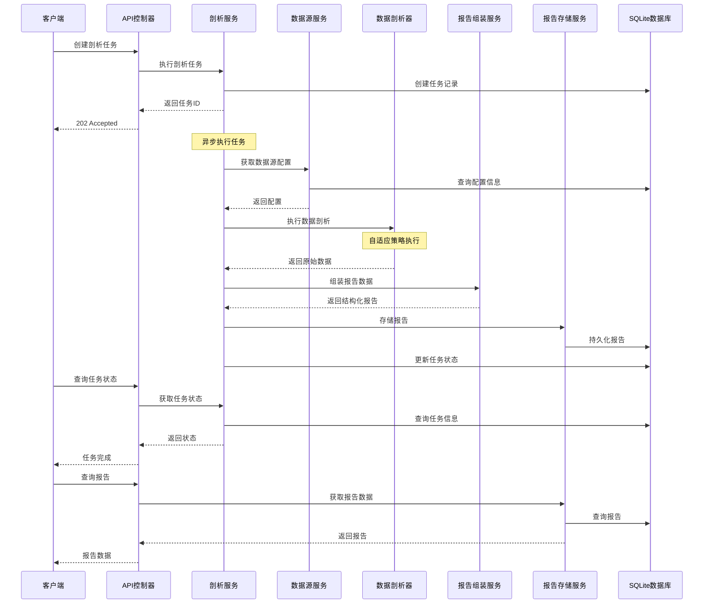

# DBCrawlerV3 项目整体设计文档

## 1. 项目概述

### 1.1 项目简介
DBCrawlerV3是一个智能数据剖析与处理平台，通过分层、策略驱动的架构，为企业提供高效、安全的数据剖析能力。平台支持多种异构数据源的统一接入和分析，包括关系型数据库（MySQL、PostgreSQL、SQLite等）和文件类数据源（Excel等）。

### 1.2 核心特性
- **统一数据接入**: 支持多种数据源类型的无缝接入
- **自适应剖析策略**: 根据数据规模自动选择最优执行路径
- **轻量级架构**: 基于SQLite的轻量级持久化方案
- **灵活剖析范围**: 支持数据库级和Schema级的灵活配置
- **分层查询接口**: 提供摘要和详细两种查询模式
- **载荷压缩**: 支持紧凑格式以适应AI应用场景

### 1.3 技术栈
- **后端**: Spring Boot 3.x, JPA/Hibernate, SQLite
- **前端**: Vue 3, TypeScript, Element Plus
- **数据库**: SQLite (核心存储), 支持MySQL/PostgreSQL等外部数据源
- **文件处理**: Apache POI (Excel处理)
- **API文档**: OpenAPI 3.0/Swagger

## 2. 系统架构设计

### 2.1 整体架构

```
┌─────────────────────────────────────────────────────────────┐
│                    前端展示层 (Frontend)                      │
├─────────────────────────────────────────────────────────────┤
│  数据源管理  │  任务创建  │  报告查看  │  文件上传  │  仪表板   │
└─────────────────────────────────────────────────────────────┘
                              │
                              ▼
┌─────────────────────────────────────────────────────────────┐
│                    API控制层 (Controllers)                   │
├─────────────────────────────────────────────────────────────┤
│ DataSource │ Profiling │ Report │ File │ Dashboard │ API Doc │
│ Controller │ Controller│Controller│Controller│Controller│     │
└─────────────────────────────────────────────────────────────┘
                              │
                              ▼
┌─────────────────────────────────────────────────────────────┐
│                    业务服务层 (Services)                     │
├─────────────────────────────────────────────────────────────┤
│ DataSource │ Profiling │ Report   │ File     │ Dashboard    │
│ Service    │ Service   │ Assembly │ AsTable  │ Service      │
│            │           │ Service  │ Service  │              │
│            │           │ Structured│ File     │              │
│            │           │ Report   │ Management│              │
│            │           │ Service  │ Service  │              │
└─────────────────────────────────────────────────────────────┘
                              │
                              ▼
┌─────────────────────────────────────────────────────────────┐
│                    数据剖析层 (Profilers)                    │
├─────────────────────────────────────────────────────────────┤
│ IDatabaseProfiler │ MySQL    │ PostgreSQL │ SQLite │ Oracle │
│ (Interface)       │ Profiler │ Profiler   │Profiler│Profiler│
└─────────────────────────────────────────────────────────────┘
                              │
                              ▼
┌─────────────────────────────────────────────────────────────┐
│                    数据访问层 (Repositories)                 │
├─────────────────────────────────────────────────────────────┤
│ DataSource │ Profiling │ Structured │ File     │ JPA        │
│ Repository │ Task      │ Report     │ Metadata │ Repositories│
│            │ Repository│ Repository │ Repository│            │
└─────────────────────────────────────────────────────────────┘
                              │
                              ▼
┌─────────────────────────────────────────────────────────────┐
│                    数据存储层 (Storage)                      │
├─────────────────────────────────────────────────────────────┤
│     SQLite (核心存储)     │        外部数据源               │
│  ┌─────────────────────┐  │  ┌─────────────────────────────┐ │
│  │ • 数据源配置        │  │  │ • MySQL                     │ │
│  │ • 任务管理          │  │  │ • PostgreSQL                │ │
│  │ • 报告存储          │  │  │ • SQLServer                 │ │
│  │ • 文件元数据        │  │  │ • Oracle                    │ │
│  │ • 文件转换表        │  │  │ • Excel Files               │ │
│  └─────────────────────┘  │  └─────────────────────────────┘ │
└─────────────────────────────────────────────────────────────┘
```

### 2.2 分层架构说明

#### 2.2.1 前端展示层 (Frontend Layer)
- **职责**: 用户界面展示和交互
- **技术**: Vue 3 + TypeScript + Element Plus
- **主要组件**:
  - 数据源管理界面
  - 剖析任务创建和监控
  - 报告查看和分析
  - 文件上传和管理
  - 系统仪表板

#### 2.2.2 API控制层 (Controller Layer)
- **职责**: HTTP请求处理、参数验证、响应封装
- **技术**: Spring Boot REST Controllers
- **主要控制器**:
  - `DataSourceController`: 数据源管理API
  - `ProfilingTaskController`: 剖析任务API
  - `ReportController`: 报告查询API
  - `FileController`: 文件管理API
  - `DashboardController`: 仪表板API

#### 2.2.3 业务服务层 (Service Layer)
- **职责**: 核心业务逻辑实现、事务管理、服务编排
- **主要服务**:
  - `DataSourceService`: 数据源配置管理
  - `ProfilingService`: 剖析任务编排和执行
  - `ReportAssemblyService`: 报告数据组装和加工
  - `StructuredReportService`: 报告存储和查询
  - `FileAsTableService`: 文件到表的转换服务
  - `FileManagementService`: 文件管理服务

#### 2.2.4 数据剖析层 (Profiler Layer)
- **职责**: 特定数据库的剖析逻辑实现
- **设计模式**: 策略模式 + 工厂模式
- **核心接口**: `IDatabaseProfiler`
- **具体实现**:
  - `MySqlProfiler`: MySQL数据库剖析器
  - `PostgreSqlProfiler`: PostgreSQL数据库剖析器
  - `SqliteProfiler`: SQLite数据库剖析器
  - `OracleProfiler`: Oracle数据库剖析器

#### 2.2.5 数据访问层 (Repository Layer)
- **职责**: 数据持久化操作
- **技术**: Spring Data JPA
- **主要Repository**:
  - `DataSourceConfigRepository`
  - `ProfilingTaskRepository`
  - `StructuredReportRepository`
  - `FileMetadataRepository`

#### 2.2.6 数据存储层 (Storage Layer)
- **核心存储**: SQLite数据库
- **外部数据源**: 支持多种关系型数据库和文件

## 3. 核心模块设计

### 3.1 数据源管理模块

#### 3.1.1 模块职责
- 统一管理多类型数据源的连接配置
- 支持数据源的增删改查操作
- 提供数据源连接测试功能
- 支持Schema级别的范围定义

#### 3.1.2 核心组件
- **实体**: `DataSourceConfig`
- **服务**: `DataSourceService`
- **控制器**: `DataSourceController`
- **仓储**: `DataSourceConfigRepository`

#### 3.1.3 支持的数据源类型
- `MYSQL`: MySQL数据库
- `POSTGRESQL`: PostgreSQL数据库
- `SQLSERVER`: SQL Server数据库
- `SQLITE`: SQLite数据库
- `ORACLE`: Oracle数据库
- `FILE`: 文件类数据源（Excel等）

### 3.2 数据剖析引擎模块

#### 3.2.1 模块职责
- 接收并编排单源及多源剖析任务
- 实现自适应剖析策略
- 管理任务生命周期
- 协调各个Profiler的执行

#### 3.2.2 核心组件
- **服务**: `ProfilingService`
- **接口**: `IDatabaseProfiler`
- **实现**: 各种数据库Profiler
- **实体**: `ProfilingTask`

#### 3.2.3 自适应剖析策略
```
┌─────────────────┐
│   开始剖析任务   │
└─────────────────┘
          │
          ▼
┌─────────────────┐
│   获取表信息     │
│ (SHOW TABLES等) │
└─────────────────┘
          │
          ▼
┌─────────────────┐
│   预检表大小     │
│ (COUNT估算等)   │
└─────────────────┘
          │
          ▼
┌─────────────────┐      ┌─────────────────┐
│ 行数 < 阈值？    │ Yes  │   精确查询模式   │
│ (默认100万)     │ ──── │ (完整统计分析)   │
└─────────────────┘      └─────────────────┘
          │ No
          ▼
┌─────────────────┐
│   近似查询模式   │
│ (采样统计分析)   │
└─────────────────┘
```

### 3.3 报告组装模块

#### 3.3.1 模块职责
- 将原始剖析数据转换为结构化报告
- 计算派生指标和统计信息
- 提供数据格式转换功能
- 支持载荷压缩格式

#### 3.3.2 核心组件
- **服务**: `ReportAssemblyService`
- **服务**: `StructuredReportService`
- **服务**: `ReportTransformService`
- **实体**: `StructuredReport`

#### 3.3.3 报告处理流程
```
RawProfileDataDto → ReportAssemblyService → StructuredReportDto
                                │
                                ▼
                    ┌─────────────────────┐
                    │   数据加工处理       │
                    │ • 计算派生指标       │
                    │ • 统计信息汇总       │
                    │ • 数据质量评估       │
                    │ • 格式标准化         │
                    └─────────────────────┘
                                │
                                ▼
                    StructuredReportService → 持久化存储
```

### 3.4 文件即服务模块

#### 3.4.1 模块职责
- 处理Excel等文件的上传和解析
- 将文件数据转换为SQLite表结构
- 提供文件元数据管理
- 支持多Sheet文件的处理

#### 3.4.2 核心组件
- **服务**: `FileAsTableService`
- **服务**: `FileManagementService`
- **服务**: `FileService`
- **实体**: `FileMetadata`

#### 3.4.3 文件处理流程
```
┌─────────────────┐
│   文件上传       │
└─────────────────┘
          │
          ▼
┌─────────────────┐
│   文件解析       │
│ (Apache POI)    │
└─────────────────┘
          │
          ▼
┌─────────────────┐
│  创建SQLite表   │
│ (每个Sheet一表) │
└─────────────────┘
          │
          ▼
┌─────────────────┐
│   数据导入       │
│ (批量插入)      │
└─────────────────┘
          │
          ▼
┌─────────────────┐
│ 创建数据源配置   │
│ (FILE类型)      │
└─────────────────┘
```

## 4. 数据流概览

### 4.1 完整数据流程



### 4.2 关键数据流转点

1. **任务创建阶段**
   - 输入: `ProfilingTaskRequest`
   - 输出: `TaskStatusResponse`
   - 关键操作: 任务记录创建、异步执行启动

2. **数据获取阶段**
   - 输入: `DataSourceConfig`
   - 输出: `RawProfileDataDto`
   - 关键操作: 自适应策略选择、SQL执行

3. **数据组装阶段**
   - 输入: `RawProfileDataDto`
   - 输出: `StructuredReportDto`
   - 关键操作: 指标计算、格式转换

4. **报告查询阶段**
   - 输入: 查询请求
   - 输出: 摘要或详细报告
   - 关键操作: 数据检索、格式适配

## 5. 技术架构决策

### 5.1 架构原则
- **单一职责**: 每个模块职责明确，边界清晰
- **开放封闭**: 支持新数据源类型的扩展
- **依赖倒置**: 面向接口编程，降低耦合
- **配置外化**: 关键配置可外部化管理

### 5.2 关键技术选型

#### 5.2.1 SQLite作为核心存储
**优势**:
- 轻量级，无需独立数据库服务
- 支持完整的SQL功能
- 文件级别的数据库，便于部署和备份
- 支持并发读取，适合读多写少场景

**适用场景**:
- 中小规模数据剖析任务
- 单机部署环境
- 快速原型和开发

#### 5.2.2 自适应剖析策略
**设计理念**:
- 根据数据规模自动选择执行策略
- 平衡分析精度与系统性能
- 对用户透明，无需手动配置

**实现方式**:
- 预检阶段获取表大小估算
- 基于阈值自动选择精确或近似模式
- 支持策略参数的动态调整

#### 5.2.3 分层查询接口
**设计目标**:
- 满足不同场景的查询需求
- 优化网络传输和响应性能
- 支持AI应用的数据消费

**实现特点**:
- 摘要查询：快速概览，数据量小
- 详细查询：完整信息，支持分页
- 载荷压缩：紧凑格式，减少传输开销

## 6. 扩展性设计

### 6.1 新数据源支持
通过实现`IDatabaseProfiler`接口，可以轻松添加新的数据源支持：

```java
@Component
public class NewDatabaseProfiler implements IDatabaseProfiler {
    @Override
    public boolean supports(DataSourceType type) {
        return DataSourceType.NEW_DATABASE.equals(type);
    }
    
    @Override
    public RawProfileDataDto profile(DataSourceConfig config) {
        // 实现具体的剖析逻辑
    }
}
```

### 6.2 自定义指标扩展
通过扩展`ReportAssemblyService`，可以添加新的派生指标计算：

```java
@Service
public class CustomMetricsCalculator {
    public void calculateCustomMetrics(StructuredReportDto report) {
        // 实现自定义指标计算逻辑
    }
}
```

### 6.3 存储扩展
支持从SQLite迁移到其他数据库系统：
- 通过JPA抽象，支持多种数据库
- 配置文件切换数据源
- 数据迁移工具支持

## 7. 性能优化策略

### 7.1 查询优化
- 自适应剖析策略减少大表查询开销
- 索引优化提升查询性能
- 连接池管理优化数据库连接

### 7.2 内存管理
- 流式处理大文件，避免内存溢出
- 分页查询控制内存使用
- 缓存热点数据提升响应速度

### 7.3 并发处理
- 异步任务执行，提升用户体验
- 线程池管理并发任务
- 数据库连接池优化并发访问

## 8. 安全性考虑

### 8.1 数据源安全
- 敏感信息加密存储
- 连接参数验证
- 访问权限控制

### 8.2 文件安全
- 文件类型验证
- 文件大小限制
- 恶意文件检测

### 8.3 API安全
- 输入参数验证
- SQL注入防护
- 访问频率限制

## 9. 监控和运维

### 9.1 日志管理
- 分级日志记录
- 关键操作审计
- 错误信息追踪

### 9.2 性能监控
- 任务执行时间统计
- 数据库查询性能监控
- 系统资源使用监控

### 9.3 健康检查
- 数据源连接状态检查
- 系统组件健康状态
- 自动故障恢复机制

---

**文档版本**: v1.0  
**最后更新**: 2025年1月  
**维护者**: DBCrawlerV3开发团队