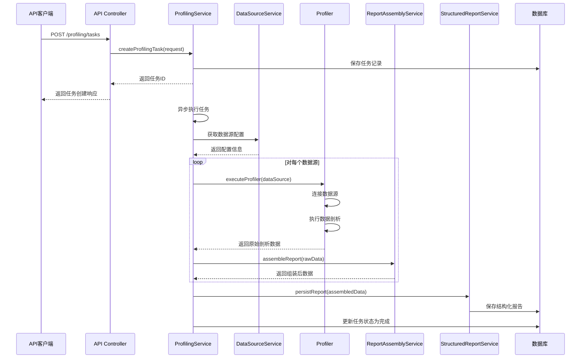
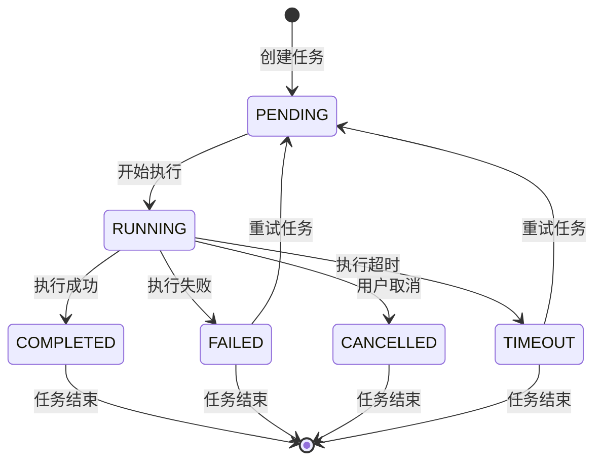
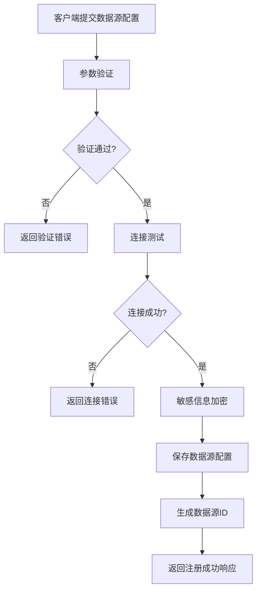
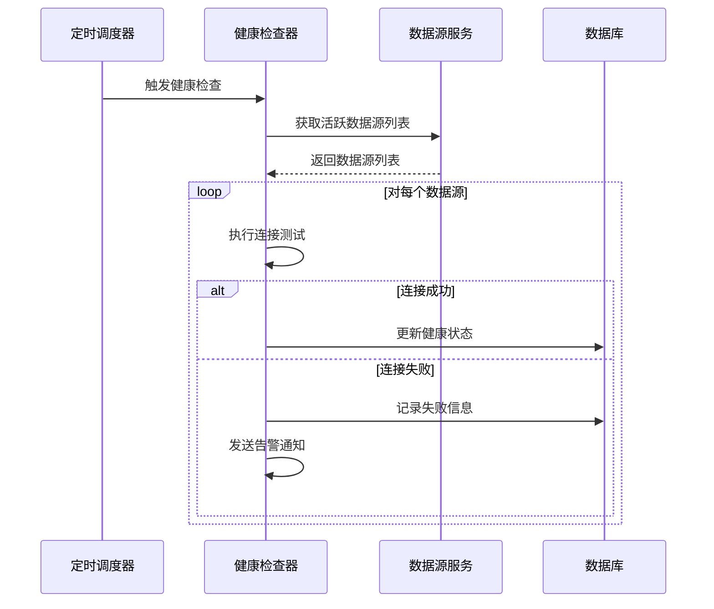
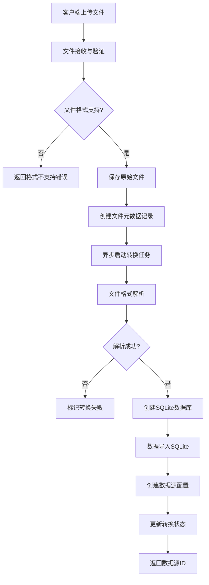
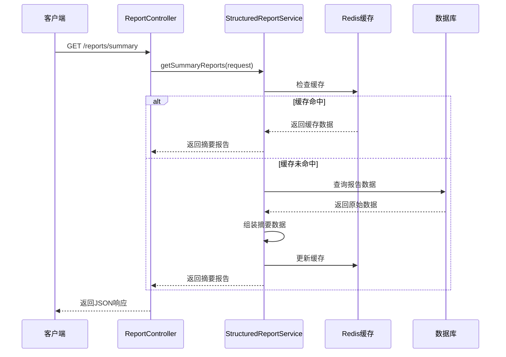
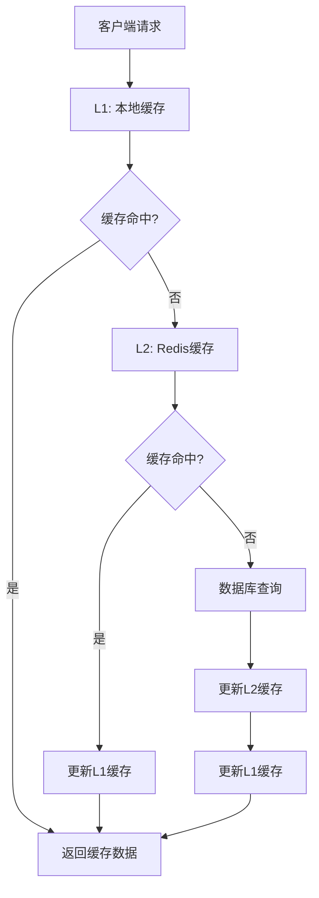
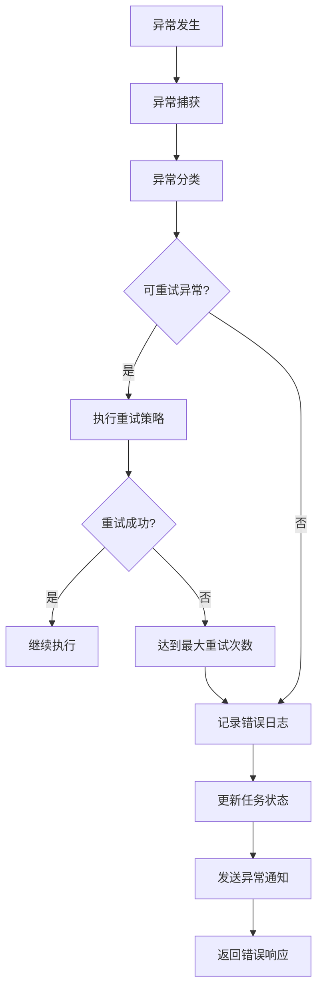

# DBCrawlerV3 项目流程文档

## 1. 文档概述

### 1.1 文档目的
本文档详细描述了DBCrawlerV3智能数据剖析与处理平台的核心业务流程、系统内部状态管理机制以及各模块间的数据交互与传输流程。通过本文档，开发人员可以深入理解系统的运行机制和数据流转过程。

### 1.2 适用范围
- 系统架构师
- 后端开发人员
- 运维工程师
- 系统集成人员

### 1.3 流程分类
本文档涵盖以下几类流程：
- **核心业务流程**: 数据剖析任务的完整生命周期
- **数据源管理流程**: 数据源的注册、验证和管理
- **文件处理流程**: 文件上传、转换和数据源化
- **报告查询流程**: 报告的生成、缓存和查询
- **异常处理流程**: 错误处理和恢复机制

## 2. 核心业务流程

### 2.1 数据剖析任务完整生命周期

#### 2.1.1 流程概览


#### 2.1.2 详细流程步骤

**步骤1: 任务创建与初始化**
```
输入: ProfilingTaskRequest
处理:
  1. 验证请求参数
  2. 检查数据源有效性
  3. 生成唯一任务ID
  4. 创建任务记录(状态: PENDING)
  5. 初始化任务上下文
输出: TaskStatusResponse
```

**步骤2: 任务异步执行启动**
```
处理:
  1. 更新任务状态为RUNNING
  2. 记录任务开始时间
  3. 创建执行上下文
  4. 初始化进度跟踪
  5. 启动异步执行线程
```

**步骤3: 数据源配置获取**
```
输入: 数据源ID列表
处理:
  1. 批量查询数据源配置
  2. 验证数据源状态(active=true)
  3. 解密敏感信息(密码等)
  4. 构建连接配置对象
  5. 验证连接可用性
输出: DataSourceConfig列表
```

**步骤4: 数据剖析执行**
```
对每个数据源:
  输入: DataSourceConfig, ProfilingScope
  处理:
    1. 建立数据库连接
    2. 获取元数据信息
    3. 执行采样策略
    4. 计算统计指标
    5. 收集约束信息
    6. 生成样本数据
  输出: RawProfileDataDto
```

**步骤5: 报告组装与丰富化**
```
输入: RawProfileDataDto
处理:
  1. 数据质量评估
  2. 统计指标计算
  3. 模式识别与分析
  4. 关系推断
  5. 异常检测
  6. 数据分类标记
输出: EnrichedReportData
```

**步骤6: 结构化报告持久化**
```
输入: EnrichedReportData
处理:
  1. 数据格式转换
  2. 压缩优化
  3. 分片存储(大数据)
  4. 索引创建
  5. 缓存预热
输出: StructuredReportDto
```

**步骤7: 任务完成与清理**
```
处理:
  1. 更新任务状态为COMPLETED
  2. 记录完成时间
  3. 计算执行统计
  4. 清理临时资源
  5. 发送完成通知
```

### 2.2 任务状态管理流程

#### 2.2.1 状态转换图


#### 2.2.2 状态管理规则

**PENDING状态**:
- 任务已创建但未开始执行
- 可以被取消
- 可以修改任务参数
- 等待执行资源分配

**RUNNING状态**:
- 任务正在执行中
- 定期更新进度信息
- 可以被取消(优雅停止)
- 监控执行超时

**COMPLETED状态**:
- 任务执行成功完成
- 报告数据已持久化
- 不可再次执行
- 保留执行统计信息

**FAILED状态**:
- 任务执行失败
- 记录失败原因和错误信息
- 可以重试执行
- 保留部分执行结果

**TIMEOUT状态**:
- 任务执行超时
- 自动停止执行
- 可以重试执行
- 保留超时前的执行结果

**CANCELLED状态**:
- 用户主动取消任务
- 优雅停止执行
- 清理已分配资源
- 保留取消前的执行结果

## 3. 数据源管理流程

### 3.1 数据源注册流程

#### 3.1.1 流程图


#### 3.1.2 详细处理步骤

**步骤1: 参数验证**
```java
// 验证必填字段
validateRequired(name, type, properties);

// 验证数据源类型
validateDataSourceType(type);

// 验证连接属性
switch(type) {
    case MYSQL:
        validateMySQLProperties(properties);
        break;
    case POSTGRESQL:
        validatePostgreSQLProperties(properties);
        break;
    case FILE:
        validateFileProperties(properties);
        break;
}
```

**步骤2: 连接测试**
```java
// 建立测试连接
Connection testConnection = createConnection(dataSourceConfig);

// 执行简单查询验证
String testQuery = getTestQuery(dataSourceConfig.getType());
boolean isValid = executeTestQuery(testConnection, testQuery);

// 获取数据库元信息
DatabaseMetaData metaData = testConnection.getMetaData();
String version = metaData.getDatabaseProductVersion();

// 关闭测试连接
testConnection.close();
```

**步骤3: 敏感信息处理**
```java
// 加密密码
String encryptedPassword = encryptionService.encrypt(password);

// 更新配置
properties.put("password", encryptedPassword);
properties.put("encrypted", true);
```

### 3.2 数据源验证流程

#### 3.2.1 定期健康检查


#### 3.2.2 健康检查策略

**检查频率**:
- 正常状态: 每30分钟检查一次
- 异常状态: 每5分钟检查一次
- 关键数据源: 每10分钟检查一次

**检查内容**:
```java
public class HealthCheckResult {
    private boolean isConnectable;      // 连接可达性
    private long responseTime;          // 响应时间
    private String version;             // 数据库版本
    private int activeConnections;      // 活跃连接数
    private String lastError;           // 最后错误信息
    private LocalDateTime checkTime;    // 检查时间
}
```

## 4. 文件处理流程

### 4.1 文件上传与转换流程

#### 4.1.1 完整流程图


#### 4.1.2 文件类型处理策略

**Excel文件处理**:
```java
public class ExcelProcessor {
    public ConversionResult processExcel(File excelFile) {
        // 1. 读取工作簿
        Workbook workbook = WorkbookFactory.create(excelFile);
        
        // 2. 遍历工作表
        List<TableSchema> schemas = new ArrayList<>();
        for (Sheet sheet : workbook) {
            TableSchema schema = analyzeSheet(sheet);
            schemas.add(schema);
        }
        
        // 3. 创建SQLite数据库
        String dbPath = createSQLiteDatabase(schemas);
        
        // 4. 导入数据
        importDataToSQLite(workbook, dbPath, schemas);
        
        return new ConversionResult(dbPath, schemas);
    }
}
```

**CSV文件处理**:
```java
public class CSVProcessor {
    public ConversionResult processCSV(File csvFile) {
        // 1. 检测编码和分隔符
        CSVFormat format = detectCSVFormat(csvFile);
        
        // 2. 分析数据结构
        TableSchema schema = analyzeCSVStructure(csvFile, format);
        
        // 3. 创建SQLite表
        String dbPath = createSQLiteTable(schema);
        
        // 4. 批量导入数据
        importCSVData(csvFile, dbPath, schema, format);
        
        return new ConversionResult(dbPath, Arrays.asList(schema));
    }
}
```

### 4.2 文件转换状态管理

#### 4.2.1 转换状态枚举
```java
public enum ConversionStatus {
    PENDING,        // 等待转换
    PROCESSING,     // 转换中
    COMPLETED,      // 转换完成
    FAILED,         // 转换失败
    CANCELLED       // 转换取消
}
```

#### 4.2.2 状态更新流程
```java
public class FileConversionService {
    
    @Async
    public void convertFile(Long fileId) {
        try {
            // 更新状态为处理中
            updateConversionStatus(fileId, PROCESSING);
            
            // 执行转换
            ConversionResult result = performConversion(fileId);
            
            // 创建数据源
            DataSource dataSource = createDataSource(result);
            
            // 更新状态为完成
            updateConversionStatus(fileId, COMPLETED, dataSource.getId());
            
        } catch (Exception e) {
            // 更新状态为失败
            updateConversionStatus(fileId, FAILED, e.getMessage());
        }
    }
}
```

## 5. 报告查询流程

### 5.1 摘要报告查询流程

#### 5.1.1 查询流程图


#### 5.1.2 摘要数据组装逻辑
```java
public class SummaryReportAssembler {
    
    public List<ReportSummaryDto> assembleSummary(List<StructuredReport> reports) {
        Map<String, List<StructuredReport>> groupedByDataSource = 
            reports.stream().collect(Collectors.groupingBy(StructuredReport::getDataSourceId));
        
        return groupedByDataSource.entrySet().stream()
            .map(this::createSummaryForDataSource)
            .collect(Collectors.toList());
    }
    
    private ReportSummaryDto createSummaryForDataSource(Map.Entry<String, List<StructuredReport>> entry) {
        String dataSourceId = entry.getKey();
        List<StructuredReport> reports = entry.getValue();
        
        // 聚合统计信息
        SummaryStatistics stats = calculateStatistics(reports);
        
        // 构建摘要对象
        return ReportSummaryDto.builder()
            .dataSourceId(dataSourceId)
            .dataSourceName(getDataSourceName(dataSourceId))
            .dataSourceType(getDataSourceType(dataSourceId))
            .schemas(buildSchemasSummary(reports))
            .statistics(stats)
            .build();
    }
}
```

### 5.2 详细报告查询流程

#### 5.2.1 分页查询处理
```java
public class DetailedReportService {
    
    public PagedResult<StructuredReportDto> getDetailedReports(DetailedReportRequest request) {
        // 1. 参数验证
        validateRequest(request);
        
        // 2. 构建查询条件
        QueryCriteria criteria = buildQueryCriteria(request);
        
        // 3. 执行分页查询
        Page<StructuredReport> page = reportRepository.findByCriteria(criteria, request.getPagination());
        
        // 4. 数据转换
        List<StructuredReportDto> dtos = page.getContent().stream()
            .map(this::convertToDto)
            .collect(Collectors.toList());
        
        // 5. 构建分页结果
        return new PagedResult<>(dtos, page.getTotalElements(), page.getTotalPages());
    }
}
```

#### 5.2.2 数据格式转换
```java
public class ReportFormatConverter {
    
    public StructuredReportDto convertToStandardFormat(StructuredReport report) {
        return StructuredReportDto.builder()
            .taskId(report.getTaskId())
            .dataSourceId(report.getDataSourceId())
            .database(convertDatabaseInfo(report.getDatabaseInfo()))
            .schemas(convertSchemas(report.getSchemas()))
            .summary(calculateSummary(report))
            .build();
    }
    
    public CompactReportDto convertToCompactFormat(StructuredReport report) {
        // 使用header-rows格式减少数据传输量
        return CompactReportDto.builder()
            .headers(extractHeaders(report))
            .rows(extractRows(report))
            .metadata(extractMetadata(report))
            .build();
    }
}
```

## 6. 缓存管理流程

### 6.1 多级缓存架构

#### 6.1.1 缓存层次结构


#### 6.1.2 缓存策略配置
```java
@Configuration
public class CacheConfiguration {
    
    @Bean
    public CacheManager cacheManager() {
        RedisCacheManager.Builder builder = RedisCacheManager
            .RedisCacheManagerBuilder
            .fromConnectionFactory(redisConnectionFactory())
            .cacheDefaults(cacheConfiguration());
        
        return builder.build();
    }
    
    private RedisCacheConfiguration cacheConfiguration() {
        return RedisCacheConfiguration.defaultCacheConfig()
            .entryTtl(Duration.ofHours(1))  // 默认1小时过期
            .serializeKeysWith(RedisSerializationContext.SerializationPair
                .fromSerializer(new StringRedisSerializer()))
            .serializeValuesWith(RedisSerializationContext.SerializationPair
                .fromSerializer(new GenericJackson2JsonRedisSerializer()));
    }
}
```

### 6.2 缓存更新策略

#### 6.2.1 缓存失效机制
```java
public class CacheInvalidationService {
    
    @EventListener
    public void handleReportUpdate(ReportUpdatedEvent event) {
        String dataSourceId = event.getDataSourceId();
        
        // 清除相关缓存
        evictSummaryCache(dataSourceId);
        evictDetailedCache(dataSourceId);
        evictStatisticsCache(dataSourceId);
        
        // 预热关键缓存
        preloadSummaryCache(dataSourceId);
    }
    
    private void evictSummaryCache(String dataSourceId) {
        String cacheKey = "summary:" + dataSourceId;
        cacheManager.getCache("reports").evict(cacheKey);
    }
}
```

#### 6.2.2 缓存预热流程
```java
@Component
public class CacheWarmupService {
    
    @Scheduled(fixedRate = 3600000) // 每小时执行一次
    public void warmupCache() {
        // 获取热点数据源
        List<String> hotDataSources = getHotDataSources();
        
        // 并行预热缓存
        hotDataSources.parallelStream().forEach(dataSourceId -> {
            try {
                preloadSummaryData(dataSourceId);
                preloadStatisticsData(dataSourceId);
            } catch (Exception e) {
                log.warn("Failed to warmup cache for dataSource: {}", dataSourceId, e);
            }
        });
    }
}
```

## 7. 异常处理流程

### 7.1 异常分类与处理策略

#### 7.1.1 异常分类体系
```java
public class ExceptionHierarchy {
    // 业务异常
    public static class BusinessException extends RuntimeException {
        private final String errorCode;
        private final Object[] args;
    }
    
    // 数据源异常
    public static class DataSourceException extends BusinessException {
        public static class ConnectionException extends DataSourceException {}
        public static class QueryException extends DataSourceException {}
        public static class AuthenticationException extends DataSourceException {}
    }
    
    // 任务执行异常
    public static class TaskExecutionException extends BusinessException {
        public static class TimeoutException extends TaskExecutionException {}
        public static class InterruptedException extends TaskExecutionException {}
        public static class ResourceException extends TaskExecutionException {}
    }
    
    // 文件处理异常
    public static class FileProcessingException extends BusinessException {
        public static class UnsupportedFormatException extends FileProcessingException {}
        public static class CorruptedFileException extends FileProcessingException {}
        public static class ConversionException extends FileProcessingException {}
    }
}
```

#### 7.1.2 异常处理流程


### 7.2 重试机制

#### 7.2.1 重试策略配置
```java
@Configuration
@EnableRetry
public class RetryConfiguration {
    
    @Bean
    public RetryTemplate retryTemplate() {
        RetryTemplate retryTemplate = new RetryTemplate();
        
        // 重试策略：指数退避
        ExponentialBackOffPolicy backOffPolicy = new ExponentialBackOffPolicy();
        backOffPolicy.setInitialInterval(1000);  // 初始间隔1秒
        backOffPolicy.setMultiplier(2.0);        // 倍数2
        backOffPolicy.setMaxInterval(30000);     // 最大间隔30秒
        retryTemplate.setBackOffPolicy(backOffPolicy);
        
        // 重试条件：最多重试3次
        SimpleRetryPolicy retryPolicy = new SimpleRetryPolicy();
        retryPolicy.setMaxAttempts(3);
        retryTemplate.setRetryPolicy(retryPolicy);
        
        return retryTemplate;
    }
}
```

#### 7.2.2 重试逻辑实现
```java
@Service
public class ProfilingExecutionService {
    
    @Retryable(
        value = {DataSourceException.class, QueryException.class},
        maxAttempts = 3,
        backoff = @Backoff(delay = 1000, multiplier = 2)
    )
    public RawProfileDataDto executeProfiler(DataSourceConfig config) {
        try {
            return profilerEngine.profile(config);
        } catch (SQLException e) {
            log.warn("Database query failed, will retry: {}", e.getMessage());
            throw new QueryException("Query execution failed", e);
        }
    }
    
    @Recover
    public RawProfileDataDto recover(DataSourceException ex, DataSourceConfig config) {
        log.error("All retry attempts failed for dataSource: {}", config.getSourceId(), ex);
        throw new TaskExecutionException("Profiling failed after all retries", ex);
    }
}
```

## 8. 监控与日志流程

### 8.1 性能监控流程

#### 8.1.1 监控指标收集
```java
@Component
public class PerformanceMonitor {
    
    private final MeterRegistry meterRegistry;
    private final Timer.Sample sample;
    
    @EventListener
    public void handleTaskStart(TaskStartedEvent event) {
        // 开始计时
        Timer.Sample sample = Timer.start(meterRegistry);
        taskTimers.put(event.getTaskId(), sample);
        
        // 记录任务开始指标
        Counter.builder("tasks.started")
            .tag("dataSource", event.getDataSourceType())
            .register(meterRegistry)
            .increment();
    }
    
    @EventListener
    public void handleTaskCompleted(TaskCompletedEvent event) {
        // 停止计时
        Timer.Sample sample = taskTimers.remove(event.getTaskId());
        if (sample != null) {
            sample.stop(Timer.builder("task.duration")
                .tag("status", "completed")
                .register(meterRegistry));
        }
        
        // 记录完成指标
        Counter.builder("tasks.completed")
            .tag("dataSource", event.getDataSourceType())
            .register(meterRegistry)
            .increment();
    }
}
```

#### 8.1.2 健康检查端点
```java
@Component
public class SystemHealthIndicator implements HealthIndicator {
    
    @Override
    public Health health() {
        Health.Builder builder = new Health.Builder();
        
        try {
            // 检查数据库连接
            checkDatabaseHealth(builder);
            
            // 检查Redis连接
            checkRedisHealth(builder);
            
            // 检查任务执行状态
            checkTaskExecutionHealth(builder);
            
            return builder.up().build();
            
        } catch (Exception e) {
            return builder.down(e).build();
        }
    }
    
    private void checkDatabaseHealth(Health.Builder builder) {
        long startTime = System.currentTimeMillis();
        boolean isHealthy = databaseHealthChecker.isHealthy();
        long responseTime = System.currentTimeMillis() - startTime;
        
        builder.withDetail("database", Map.of(
            "status", isHealthy ? "UP" : "DOWN",
            "responseTime", responseTime + "ms"
        ));
    }
}
```

### 8.2 日志管理流程

#### 8.2.1 结构化日志格式
```java
@Component
public class StructuredLogger {
    
    private final Logger logger = LoggerFactory.getLogger(StructuredLogger.class);
    private final ObjectMapper objectMapper = new ObjectMapper();
    
    public void logTaskEvent(String taskId, String event, Object details) {
        try {
            Map<String, Object> logEntry = Map.of(
                "timestamp", Instant.now().toString(),
                "taskId", taskId,
                "event", event,
                "details", details,
                "thread", Thread.currentThread().getName()
            );
            
            String jsonLog = objectMapper.writeValueAsString(logEntry);
            logger.info(jsonLog);
            
        } catch (Exception e) {
            logger.error("Failed to write structured log", e);
        }
    }
}
```

#### 8.2.2 日志聚合与分析
```yaml
# logback-spring.xml配置
logging:
  pattern:
    console: "%d{yyyy-MM-dd HH:mm:ss} [%thread] %-5level %logger{36} - %msg%n"
    file: "%d{yyyy-MM-dd HH:mm:ss} [%thread] %-5level %logger{36} - %msg%n"
  level:
    com.dataprofiler: DEBUG
    org.springframework: INFO
    root: INFO
  file:
    name: logs/dbcrawler.log
    max-size: 100MB
    max-history: 30
```

## 9. 安全与权限流程

### 9.1 数据源访问安全

#### 9.1.1 敏感信息加密流程
```java
@Service
public class DataSourceSecurityService {
    
    private final AESEncryptionService encryptionService;
    
    public DataSourceConfig encryptSensitiveData(DataSourceConfig config) {
        Map<String, Object> properties = config.getProperties();
        
        // 加密密码
        if (properties.containsKey("password")) {
            String password = (String) properties.get("password");
            String encryptedPassword = encryptionService.encrypt(password);
            properties.put("password", encryptedPassword);
            properties.put("encrypted", true);
        }
        
        // 加密其他敏感字段
        encryptIfPresent(properties, "username");
        encryptIfPresent(properties, "connectionString");
        
        return config;
    }
    
    public DataSourceConfig decryptSensitiveData(DataSourceConfig config) {
        Map<String, Object> properties = config.getProperties();
        
        if (Boolean.TRUE.equals(properties.get("encrypted"))) {
            // 解密密码
            if (properties.containsKey("password")) {
                String encryptedPassword = (String) properties.get("password");
                String password = encryptionService.decrypt(encryptedPassword);
                properties.put("password", password);
            }
            
            // 解密其他敏感字段
            decryptIfPresent(properties, "username");
            decryptIfPresent(properties, "connectionString");
        }
        
        return config;
    }
}
```

### 9.2 API访问控制

#### 9.2.1 请求限流机制
```java
@Component
public class RateLimitingFilter implements Filter {
    
    private final RedisTemplate<String, String> redisTemplate;
    private final RateLimitProperties rateLimitProperties;
    
    @Override
    public void doFilter(ServletRequest request, ServletResponse response, FilterChain chain) 
            throws IOException, ServletException {
        
        HttpServletRequest httpRequest = (HttpServletRequest) request;
        String clientIp = getClientIp(httpRequest);
        String endpoint = httpRequest.getRequestURI();
        
        // 检查限流
        if (isRateLimited(clientIp, endpoint)) {
            HttpServletResponse httpResponse = (HttpServletResponse) response;
            httpResponse.setStatus(HttpStatus.TOO_MANY_REQUESTS.value());
            httpResponse.getWriter().write("{\"error\":\"Rate limit exceeded\"}");
            return;
        }
        
        chain.doFilter(request, response);
    }
    
    private boolean isRateLimited(String clientIp, String endpoint) {
        String key = "rate_limit:" + clientIp + ":" + endpoint;
        String count = redisTemplate.opsForValue().get(key);
        
        if (count == null) {
            redisTemplate.opsForValue().set(key, "1", Duration.ofMinutes(1));
            return false;
        }
        
        int currentCount = Integer.parseInt(count);
        int limit = rateLimitProperties.getLimit(endpoint);
        
        if (currentCount >= limit) {
            return true;
        }
        
        redisTemplate.opsForValue().increment(key);
        return false;
    }
}
```

## 10. 总结

### 10.1 关键流程要点

1. **异步处理**: 所有耗时操作都采用异步处理，避免阻塞用户请求
2. **状态管理**: 完善的状态机制确保任务执行的可追踪性
3. **错误处理**: 多层次的异常处理和重试机制保证系统稳定性
4. **缓存策略**: 多级缓存提升查询性能
5. **监控告警**: 全面的监控指标和日志记录
6. **安全保障**: 敏感信息加密和访问控制

### 10.2 性能优化建议

1. **并发控制**: 合理控制并发任务数量，避免资源竞争
2. **连接池管理**: 优化数据库连接池配置
3. **内存管理**: 及时释放大对象，避免内存泄漏
4. **批处理优化**: 大数据量处理时采用批处理策略
5. **索引优化**: 合理设计数据库索引提升查询效率

### 10.3 扩展性考虑

1. **模块化设计**: 各模块职责清晰，便于独立扩展
2. **插件机制**: 支持新数据源类型的插件式扩展
3. **水平扩展**: 支持多实例部署和负载均衡
4. **配置外部化**: 关键配置支持动态调整
5. **API版本控制**: 保证API的向后兼容性

---

**文档版本**: v1.0  
**最后更新**: 2025年1月  
**维护者**: DBCrawlerV3开发团队  
**相关文档**: 项目整体设计文档、项目数据定义文档、数据库设计文档