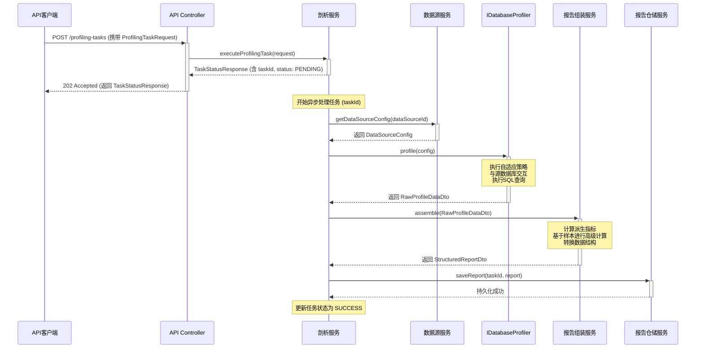

### **模块交互与数据定义文档**

#### **1. 概述**

本文档旨在详细阐述“智能数据剖析与处理平台”中，一次典型的数据剖析任务从发起到完成的端到端数据流转和模块交互过程。它将清晰地定义系统核心模块之间的调用关系、关键的输入输出参数，并给出在交互过程中使用的数据结构（数据契约）的精确定义。

本文档是系统设计和开发的核心依据，旨在确保各模块开发团队对数据流和数据结构有统一、无歧义的理解。

#### **2. 核心模块职责**

在深入流程之前，首先明确各个核心服务/模块的职责：

  * **`API Controller`**: 系统的HTTP入口，负责接收外部API请求，校验参数，并调用相应的应用服务。
  * **`ProfilingService`**: **核心业务编排器**。负责接收剖析任务请求，创建和管理任务生命周期，调度`Profiler`进行数据获取，并调用`ReportAssemblyService`进行数据加工。
  * **`DataSourceService`**: 负责管理数据源的配置信息，提供根据`dataSourceId`查询详细连接配置的功能。
  * **`IDatabaseProfiler`**: **数据获取执行器**的接口。其具体实现（如`MySqlProfiler`, `SqliteProfiler`）封装了与特定数据库方言的交互逻辑和自适应剖析策略。
  * **`ReportAssemblyService`**: **数据加工厂**。负责将原始的、未加工的剖析数据，丰富化为包含派生指标和高级统计的、对用户友好的最终报告。
  * **`StructuredReportService`**: **报告仓储服务**。负责将最终生成的分析报告进行持久化存储和对外提供查询服务。

#### **3. 核心交互流程：剖析任务的生命周期**

以下将通过时序流程图的方式，详细描述一次（单源或多源）剖析任务的完整生命周期。



**流程步骤详解：**

**步骤 1: 发起剖析任务 (Initiate Profiling Task)**

  * **交互**: `API客户端`向`API Controller`的`POST /profiling-tasks`端点发起请求。
  * **关键参数/载荷**: `ProfilingTaskRequest` 对象，其中定义了需要剖析的一个或多个数据源及其范围。
  * **处理**: `ProfilingService`接收到请求后，立即创建一个任务记录，生成唯一的`taskId`，将初始状态设置为`PENDING`，并将此`TaskStatusResponse`（包含`taskId`和状态）同步返回给客户端。整个过程响应迅速，客户端不会被长时间阻塞。

**步骤 2: 任务执行与数据源信息获取 (Task Execution & Config Fetching)**

  * **交互**: `ProfilingService`在一个**异步线程**中开始处理该`taskId`对应的任务。
  * **处理**:
    1.  `ProfilingService`将任务状态更新为`RUNNING`。
    2.  它会**顺序遍历**请求中包含的每一个`dataSourceId`。对于每个ID，它会调用`DataSourceService`获取其详细的连接配置`DataSourceConfig`。
    3.  **特殊处理**: 如果`DataSourceConfig`的类型是`FILE`，`ProfilingService`会调用`FileAsTableService`。该服务负责将文件（如Excel）内容读取并加载到一个临时的SQLite数据库表中，然后生成一个指向这个SQLite数据库的临时`DataSourceConfig`。
    4.  根据`DataSourceConfig`中的`type`字段（例如 `POSTGRESQL`, `SQLITE`等），从Spring上下文中选择一个对应的`IDatabaseProfiler`实现。

**步骤 3: 数据获取与原始剖析 (Data Acquisition & Raw Profiling)**

  * **交互**: `ProfilingService`调用选定的`Profiler`实例的`profile()`方法。
  * **关键参数/载荷**:
      * **传入**: `DataSourceConfig`对象和剖析范围`DataSourceScope`。
      * **返回**: `RawProfileDataDto`对象。
  * **处理**: 这是与源数据库交互的核心步骤。`Profiler`内部会执行“自适应剖析策略”，通过预检决定是执行精确查询还是近似查询，最终将所有直接获取到的元数据和基础指标封装到`RawProfileDataDto`中返回。此过程会针对请求中的每一个数据源重复执行。

**步骤 4: 数据组装与丰富化 (Data Assembly & Enrichment)**

  * **交互**: `ProfilingService`将上一步骤中为所有数据源收集到的`RawProfileDataDto`对象列表，传递给`ReportAssemblyService`的`assembleReport()`方法。
  * **关键参数/载荷**:
      * **传入**: `List<RawProfileDataDto>`。
      * **返回**: `List<StructuredReportDto>`。
  * **处理**: `ReportAssemblyService`对每个`RawProfileDataDto`进行深度加工，计算出派生指标（如比率、平均值、标准差等），并按照最终报告的格式组装成`StructuredReportDto`。

**步骤 5: 报告持久化与任务完成 (Report Persistence & Task Completion)**

  * **交互**: `ProfilingService`将最终生成的`List<StructuredReportDto>`交给`StructuredReportService`进行批量持久化。
  * **处理**: `StructuredReportService`将报告存入数据库。持久化成功后，`ProfilingService`将该`taskId`对应的任务状态更新为`COMPLETED`。如果任何步骤出现异常，状态将被更新为`FAILED`。

#### **4. 核心数据结构定义**

本节详细定义了在剖析任务的各个阶段中流转的核心数据对象。

##### **4.1. 数据获取阶段：`RawProfileDataDto`**

*   **角色**: 内部“原始物料”，由`Profiler`生成，供`AssemblyService`消费。其结构设计为包含尽可能多的原始信息，以便下游服务进行灵活加工。
*   **结构定义 (JSON with Comments)**:

    ```json
    {
      "dataSourceId": "ds-pg-01",
      "dataSourceType": "POSTGRESQL",
      "databaseName": "sales_dw",
      "schemaName": "public",
      "profilingTimestamp": "2023-10-27T10:00:00Z",
      "tables": [
        {
          "tableName": "orders",
          "schemaName": "public",
          "rowCount": 1500000,
          "approximateRowCount": 1498750,
          "tableType": "TABLE",
          "columns": [
            {
              "columnName": "order_id",
              "dataType": "INTEGER",
              "nativeType": "int4",
              "columnSize": 10,
              "nullable": false,
              "isPrimaryKey": true,
              "isForeignKey": false,
              "isUnique": true,
              "isIndexed": true,
              "nullCount": 0,
              "uniqueCount": 1500000,
              "minValue": 1,
              "maxValue": 1500000,
              "sampleValues": [101, 203, 504]
            }
          ]
        }
      ]
    }
    ```

##### **4.2. 数据组装与持久化产出：`StructuredReportDto`**

*   **角色**: 最终“成品”报告，由`AssemblyService`生成，由`StructuredReportService`进行持久化，并作为详细查询接口的最终返回数据。
*   **结构定义 (JSON with Comments)**:

    ```json
    {
      "taskId": "task-12345",
      "dataSourceId": "ds-pg-01",
      "dataSourceType": "POSTGRESQL",
      "database": {
        "name": "sales_dw"
      },
      "tables": [
        {
          "name": "orders",
          "schemaName": "public",
          "rowCount": 1500000,
          "comment": "销售订单核心表",
          "columns": [
            {
              "name": "order_amount",
              "type": "NUMERIC(10, 2)",
              "isPrimaryKey": false,
              "comment": "订单总金额",
              "metrics": {
                "nullCount": 50,
                "nullRate": 0.000033,
                "distinctCount": 12800,
                "distinctRate": 0.00853,
                "range": {
                  "min": 0.50,
                  "max": 9999.99
                },
                "avg": 125.75,
                "stddev": 89.5
              }
            }
          ],
          "sampleRows": {
            "headers": ["order_id", "customer_id", "order_amount"],
            "rows": [
              [101, "cust-abc", 150.00],
              [102, "cust-xyz", 75.50]
            ]
          }
        }
      ],
      "generatedAt": "2023-10-27T10:05:00Z"
    }
    ```

##### **4.3. 报告查询接口数据结构**

*   **摘要查询请求 (`ReportSummaryRequest`)**
    ```json
    {
      "dataSourceIds": ["ds-pg-01", "ds-mysql-01"]
    }
    ```

*   **摘要查询响应 (`ReportSummaryDto`)**
    ```json
    {
      "dataSourceId": "ds-pg-01",
      "dataSourceName": "PostgreSQL生产库",
      "dataSourceType": "POSTGRESQL",
      "tables": [
        {
          "name": "orders",
          "schemaName": "public",
          "rowCount": 1500000,
          "columnCount": 15,
          "comment": "销售订单核心表",
          "columnNames": ["order_id", "customer_id", "order_date", "..."],
          "sampleRows": {
            "headers": ["order_id", "customer_id", "order_amount"],
            "rows": [
              [101, "cust-abc", 150.00],
              [102, "cust-xyz", 75.50]
            ]
          }
        }
      ]
    }
    ```

*   **详细报告请求 (`DetailedReportRequest`)**
    ```json
    {
      "datasources": {
        "ds-pg-01": {
          "public": ["orders", "customers"]
        },
        "ds-mysql-01": {
          "user_db": ["users"]
        }
      },
      "pagination": {
        "page": 1,
        "pageSize": 10
      }
    }
    ```

*   **详细报告响应**: 详细报告的响应是分页后 `StructuredReportDto` 对象列表，即 `Page<StructuredReportDto>`。其具体结构见 **4.2.** 节。